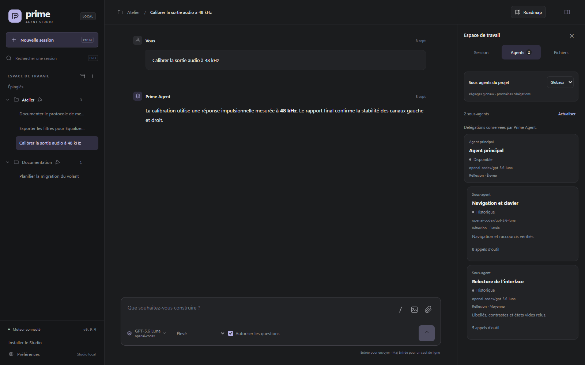

<p align="center">
  
</p>

<h1 align="center">Prime Agent Studio</h1>

<p align="center"><a href="README.md" lang="en">English</a> · <strong>Français</strong></p>

<p align="center">
  <a href="https://github.com/zerr0o/prime-agent-studio/releases/latest"></a>
  <a href="https://github.com/zerr0o/prime-agent-studio/stargazers"></a>
  <a href="LICENSE"></a>
  <a href="#démarrage-rapide"></a>
  <a href="#démarrage-rapide"></a>
</p>

<p align="center">
  <strong>Vos projets. Vos agents. Un seul espace de travail.</strong><br>
  Une interface locale en français et en anglais pour Prime Agent, pensée pour Windows.
</p>

<p align="center">
  <a href="#démarrage-rapide">Démarrage rapide</a> ·
  <a href="#pendant-que-lagent-travaille">Messages en cours</a> ·
  <a href="#images-et-pièces-jointes">Pièces jointes</a> ·
  <a href="#vos-modèles-à-portée-de-main">Modèles</a> ·
  <a href="docs/navigation.md">Projets et conversations</a> ·
  <a href="docs/knowledge.md">Connaissances du projet</a> ·
  <a href="#roadmap-du-projet">Roadmap</a> ·
  <a href="docs/mcp.md">Connexions MCP</a> ·
  <a href="docs/providers.md">Fournisseurs</a> ·
  <a href="docs/commands.md">Commandes et skills</a> ·
  <a href="docs/inspector.md">Agents et fichiers</a> ·
  <a href="docs/lan.md">Accès mobile</a> ·
  <a href="docs/desktop.md">Application Windows</a> ·
  <a href="docs/pwa.md">PWA mobile</a> ·
  <a href="docs/translations.md">Langues</a> ·
  <a href="docs/development.md">Développement</a>
</p>


<p align="center"><em>L’interface réelle, avec des données de démonstration. Les exemples de conversations et de documents conservent leur langue d’origine.</em></p>

Prime Agent Studio réunit les sessions de votre **Prime Agent local** dans une application Windows et une interface accessible depuis le navigateur. Suivez les réponses en direct, retrouvez vos projets et continuez une conversation sans ouvrir de terminal. Sous Windows, les agents et leurs outils démarrent en arrière-plan, sans fenêtres PowerShell intempestives.

**Version 3.5.0** · [Télécharger l’installateur Windows x64](https://github.com/zerr0o/prime-agent-studio/releases/download/v3.5.0/Prime-Agent-Studio_3.5.0_x64-setup.exe) · [Historique des versions](docs/changelog.md).

## Images et questions dans la conversation

Retrouvez les images du projet directement dans la réponse de l’agent et cliquez pour les agrandir. Le Studio lit le fichier d’origine sans en créer une copie supplémentaire. S’il est déplacé ou supprimé, la conversation indique que l’image n’est plus disponible.

La case **Autoriser les questions**, près du niveau de réflexion, permet à l’agent de demander votre avis. Sélectionnez une option, dépliez sa description, écrivez une autre réponse ou choisissez **Passer**. Elle est cochée par défaut ; choisissez la valeur initiale des nouvelles conversations dans **Préférences → Modèles et agents**. Chaque conversation conserve son choix enregistré. Les questions utilisent le mécanisme interactif natif de Prime Agent et se synchronisent entre PC et téléphone. [Guide de configuration](docs/configuration.md#questions-interactives-et-images-dans-la-conversation).

Dans l’application Windows, **Préférences → Notifications** permet de régler séparément les alertes pour les questions et les fins de tour. Le Studio reste silencieux lorsque l’une de ses fenêtres a le focus.


_Interface réelle avec une conversation fictive. Photo de la Lotus Elise : [Exotic Car Trader](https://www.exoticcartrader.com/listing/2005-lotus-elise-1)._

## Roadmap du projet

Gardez vos plans, tâches imbriquées et idées de backlog à côté des conversations. Agrandissez la Roadmap sur tout l’espace de travail, repliez les groupes de tâches et suivez leurs compteurs. Les descriptions restent discrètes jusqu’à leur ouverture.


_L’interface réelle avec un projet fictif et des tâches de démonstration._

Le Studio et ses agents partagent la même Roadmap. Lancez un travail depuis un plan, retrouvez sa conversation et consultez les connaissances du projet depuis le panneau. [Découvrir le guide Roadmap →](docs/roadmap.md)

## Ce que vous pouvez faire

**Français ou English** : choisissez **Préférences → Apparence → Langue** sur PC ou mobile. Le mode **Automatique** suit la langue du navigateur. Le changement est immédiat, conserve les formulaires, brouillons et pièces jointes, et laisse les agents continuer leur travail. La page de connexion mobile possède aussi son sélecteur ; l’écran hors connexion de la PWA utilise la langue choisie.

Les traductions sont réunies dans **une table unique**, avec le français et l’anglais côte à côte pour chaque texte. Une traduction manquante utilise le français, et la vérification du projet détecte les cases absentes et les paramètres incohérents. [Ajouter une langue ou une traduction](docs/translations.md).

| Fonction                              | Dans le Studio                                                                                                                               |
| ------------------------------------- | -------------------------------------------------------------------------------------------------------------------------------------------- |
| **Organiser vos projets**             | Ouvrir leurs dossiers sur le PC, les épingler ou les retirer du Studio avec confirmation ; organiser et reprendre leurs sessions.            |
| **Retrouver les travaux passés**      | Rechercher dans l’historique du projet, les mémoires et les refinements natifs, puis lire leurs sources ou les faire consulter par un agent. |
| **Suivre le travail**                 | Lire les réponses en streaming et déplier une activité regroupant les outils et le raisonnement.                                             |
| **Inspecter une session**             | Consulter son état et sa consommation, suivre les sous-agents et ouvrir leurs échanges sans changer de session.                              |
| **Consulter les fichiers**            | Parcourir le projet, lire les changements Git, prévisualiser et ouvrir les fichiers sur PC ou mobile.                                        |
| **Intervenir en direct**              | Réorienter l’agent ou préparer un message à la suite, sans arrêter son travail.                                                              |
| **Joindre des images et fichiers**    | Choisir une photo ou un document, les déposer dans la conversation ou les coller depuis le presse-papiers.                                   |
| **Voir les images du projet**         | Afficher les images dans les réponses de l’agent, les agrandir et conserver leur fichier d’origine comme source.                             |
| **Répondre aux questions de l’agent** | Autoriser les questions natives par conversation, avec des choix décrits, une réponse libre ou Passer.                                       |
| **Retrouver vos modèles**             | Rechercher par nom ou fournisseur, gérer vos favoris et choisir le niveau de réflexion.                                                      |
| **Régler les sous-agents**            | Définir le modèle et la réflexion des prochaines délégations, globalement ou par projet, avant le premier message.                           |
| **Connecter des outils MCP**          | Gérer les serveurs HTTP et stdio, OAuth, les variables, les outils autorisés et les tests de connexion.                                      |
| **Gérer les fournisseurs**            | Sur le PC, connecter un compte, enregistrer une clé API et retirer des identifiants avec confirmation.                                       |
| **Travailler en parallèle**           | Lancer des exécutions dans plusieurs sessions et passer de l’une à l’autre.                                                                  |
| **Retrouver le Studio sur mobile**    | Piloter le PC depuis un téléphone en Wi-Fi ou via Tailscale, avec un code d’accès.                                                           |
| **Installer le Studio**               | Installer l’application Windows avec ses raccourcis, ou ajouter la PWA mobile à l’écran d’accueil via HTTPS.                                 |

Les exécutions continuent lorsque vous changez de session, rechargez la page ou fermez l’onglet. Le serveur doit rester en marche.

Le menu **⋯** de chaque projet fonctionne aussi sur mobile ; le clic droit est disponible sur PC. Retirer un projet masque son entrée dans le Studio et conserve son dossier et ses sessions. Vous pouvez retrouver ceux-ci en ajoutant à nouveau le dossier. Un projet avec une exécution active ne peut pas être retiré.

Dans la liste des projets, un **point vert** indique une session en cours et un **point bleu** une réponse terminée restant à lire. Le vert est prioritaire. La session concernée porte aussi un point bleu : consultez sa dernière réponse pour l’effacer. La lecture est enregistrée sur le PC serveur et partagée entre les navigateurs, le téléphone et l’application Windows, y compris en mode consultation. Les appareils ouverts se synchronisent au prochain rafraîchissement (au plus 10 secondes), ou dès leur retour au premier plan. À la première activation de ce suivi partagé, les réponses déjà présentes constituent le point de départ commun.

Glissez un projet vers sa nouvelle position dans la liste. Sur écran tactile, utilisez sa poignée ; le reste de la liste reste disponible pour défiler. Au clavier, placez le focus sur la poignée puis utilisez les flèches haut/bas. Le menu **…** conserve aussi ces actions. L’ordre est enregistré sur le serveur et partagé entre appareils ; les projets épinglés restent en tête et se réordonnent dans leur groupe.

Dans le Studio distant, **Préférences → Se déconnecter** ferme l’accès de ce navigateur et revient au code d’accès. Les agents et les autres appareils connectés continuent de fonctionner.

Sur le PC, **Préférences → Accès distant → Changer le code** modifie le PIN à huit chiffres du Wi-Fi, de Tailscale et de la PWA. Les appareils doivent se reconnecter avec le nouveau code ; les agents continuent, sans redémarrage du Studio.

## Commandes et skills à portée de main

Tapez **`/`** ou utilisez le bouton **/** près des pièces jointes pour rechercher une commande, un skill ou un prompt du projet. Les raccourcis ouvrent les panneaux du Studio ; `/compact`, `/refine`, `/goal` et `/autonomous` sont exécutés par Prime Agent, y compris dans la file d’une session active. `/skill:nom` charge un skill avec vos consignes. Consultez le [guide des commandes, skills et prompts](docs/commands.md) pour les syntaxes et les commandes réservées au terminal.

Les skills Python sont préparées selon les réglages natifs du projet, pour le parent comme pour ses sous-agents. La [configuration du Python et la réparation des anciennes installations](docs/configuration.md#python-et-skills) détaillent la préparation automatique et le cas d’un `PRIME_AGENT_KERNEL_PYTHON` fourni par l’utilisateur.

## Session, agents et fichiers

Le panneau de droite propose trois onglets : **Session** pour l’état, les tokens et l’accès aux **Connaissances du projet**, **Agents** pour les délégations et leurs échanges, **Fichiers** pour parcourir le projet ou consulter les changements Git. Sur téléphone, le bouton de panneau en haut à droite ouvre ces vues en pleine hauteur.

Les fichiers s’affichent en lecture seule, avec un rendu Markdown, du JSON indenté et une bascule **Aperçu / Source**. Les liens vers des documents dans la conversation ouvrent le même visualiseur. **Ouvrir** lance le fichier dans son application sur le PC ; depuis le téléphone, le bouton indique **Ouvrir sur le PC**. Les changements Git concernent tout le projet, y compris le travail d’autres sessions. Le [guide du panneau](docs/inspector.md) détaille le suivi en direct et les limites des aperçus.




## Vos outils et services MCP

**Préférences → Outils → Gérer les MCP** permet d’ajouter, modifier, tester, activer ou supprimer des connexions natives de Prime Agent. Les serveurs **HTTP** et **stdio** sont pris en charge, avec les connexions **OAuth**, les variables d’environnement et les restrictions d’outils. Linear et Notion sont proposés comme intégrations natives.

Les tests découvrent les outils sans en exécuter. Les nouveaux réglages s’appliquent aux nouvelles sessions ; les sessions déjà en cours continuent avec leur configuration actuelle. Consultez le [guide MCP](docs/mcp.md), notamment pour effectuer une connexion OAuth depuis un téléphone.

<p align="center">
  
</p>

## Démarrage rapide

### Application Windows

Téléchargez l’[installateur Windows x64](https://github.com/zerr0o/prime-agent-studio/releases/latest), installez-le, puis ouvrez **Prime Agent Studio** depuis le Bureau ou le menu Démarrer. Node.js est inclus. Les builds avec préparation guidée proposent **Installer les composants manquants** au premier lancement et dans les réglages de l’application : Prime Agent **0.9.4**, npm privé, uv et Python sont téléchargés à la demande après votre clic. Les installations externes compatibles sont réutilisées ; Git Bash est détecté séparément pour les commandes shell. Configurez ensuite votre fournisseur. Les installateurs déjà publiés restent inchangés. Si vous utilisiez le VBS, choisissez **Reprendre une installation existante**. [Guide complet](docs/desktop.md).

Les mises à jour sont signées pour Tauri ; l’installateur ne possède pas encore de signature Windows Authenticode.

**Après la mise à jour :** l’application peut continuer à utiliser l’ancien serveur pendant que les agents terminent leur travail. Une fois leurs exécutions terminées, utilisez **Préférences → Mise à jour → Redémarrer le serveur** dans l’application Windows pour activer la version 3.5.0. [Guide de mise à jour](docs/desktop.md).

### Depuis le code source

**Prérequis :** Windows, **Node.js 22.8 ou ultérieur**, **uv** et **Prime Agent** installé. Un fournisseur doit être configuré avant le premier message, depuis le CLI ou le panneau **Fournisseurs** du Studio sur le PC. L’intégration des réglages des sous-agents a été vérifiée avec **Prime Agent 0.9.4**.

Téléchargez **Source code (zip)** depuis la [dernière release](https://github.com/zerr0o/prime-agent-studio/releases/latest) et extrayez l’archive, ou clonez ce dépôt. Ouvrez ensuite un terminal dans le dossier extrait :

```powershell
npm ci
npm run setup:runtime
npm run start:silent
```

Le navigateur s’ouvre sur **[127.0.0.1:3088](http://127.0.0.1:3088)**. Ensuite, un double-clic sur **`Lancer Prime Agent.vbs`** suffit : le lanceur réutilise le serveur s’il est déjà ouvert.

1. Ajoutez le dossier d’un projet avec **+** dans l’espace de travail.
2. Ouvrez une session existante ou choisissez **Nouvelle session**.
3. Sélectionnez votre modèle, puis écrivez votre demande.

Le Studio réutilise la configuration de Prime Agent : aucune clé API à coller dans le navigateur. La préparation initiale du moteur Python peut nécessiter une connexion Internet.

| Commande               | Utilité                                                             |
| ---------------------- | ------------------------------------------------------------------- |
| `npm run start:silent` | Démarrer en arrière-plan et ouvrir le navigateur.                   |
| `npm run shortcut`     | Créer un raccourci sur le Bureau.                                   |
| `npm start`            | Démarrer avec les journaux dans le terminal, pour le développement. |
| `npm run stop`         | Fermer le serveur et ses exécutions actives.                        |

**Fermer l’onglet laisse les agents travailler.** Le bouton **Arrêter** termine l’exécution sélectionnée ; `Arreter Prime Agent.vbs` ou `npm run stop` ferme tout le Studio.

### Mettre à jour une installation Git

Attendez la fin des exécutions, puis lancez ces commandes dans le dossier du Studio :

```powershell
npm run stop
git pull --ff-only
npm ci
npm run setup:runtime
npm run start:silent
```

Vos réglages locaux et les sessions natives de Prime Agent sont conservés. Pour une installation depuis une archive, remplacez les fichiers du Studio par ceux de la nouvelle release en conservant le dossier `.local`, puis relancez les étapes d’installation.

**Depuis une version 2.3 ou antérieure :** exécutez bien `npm ci` puis `npm run setup:runtime` et redémarrez le Studio pour charger le correctif des skills Python. Les kernels déjà ouverts conservent leur environnement jusqu’à leur redémarrage.

## Pendant que l’agent travaille

Le champ de saisie reste disponible pendant une exécution. Choisissez le moment où votre message doit être pris en compte :

| Mode           | Quand le message est transmis                                           |
| -------------- | ----------------------------------------------------------------------- |
| **Réorienter** | Après les outils de l’étape courante, pour ajuster la demande en cours. |
| **À la suite** | Après la réponse courante, pour enchaîner avec une nouvelle demande.    |

Vous pouvez modifier vos messages en attente, les réordonner, les retirer ou les déplacer d’un mode à l’autre. Les messages automatiques entre agents portent la mention **Automatique · protégé** et ne proposent aucun contrôle de modification ou de suppression. L’acceptation par le moteur est distincte de la transmission effective, qui apparaît ensuite dans la conversation.

Les messages reçus des sous-agents ont une carte dédiée avec leur nom et leur contenu. Les identifiants techniques restent accessibles dans **Détails de transmission**, repliés par défaut. Lorsque la file native ne fournit pas le nom de l’expéditeur, le Studio indique simplement **Message d’agent**.


## Images et pièces jointes

Deux boutons distincts accompagnent le champ de saisie : **Photo** ouvre le sélecteur d’images du téléphone ou du PC ; **Pièce jointe** accepte tout type de fichier. Vous pouvez aussi **glisser-déposer** les fichiers dans la conversation, ou **coller** les images et documents que le navigateur reçoit du presse-papiers. Le collage de texte habituel reste disponible.

Les aperçus permettent de retirer une pièce avant l’envoi. Les pièces du brouillon restent dans ce navigateur après un rechargement. Vous pouvez les envoyer seules, avec une consigne, en **Réorienter** ou **À la suite**. Dans la conversation, cliquez sur une image pour l’agrandir ou sur un fichier pour le télécharger.


Les images **PNG, JPEG, GIF et WebP** sont transmises au moteur avec leurs pixels ; choisissez un modèle compatible avec les images. Les autres fichiers sont conservés sur le PC et leur chemin est transmis à Prime Agent pour ses outils. Les autres formats d’image peuvent être joints comme fichiers.

| Par message | Nombre maximal | Taille par pièce | Taille cumulée |
| ----------- | -------------- | ---------------- | -------------- |
| Images      | 4              | 4 Mo             | 8 Mo           |
| Fichiers    | 8              | 10 Mo            | 20 Mo          |

Vous pouvez combiner images et fichiers, dans la limite de **8 pièces jointes au total**. Ces fonctions sont aussi disponibles sur le téléphone, en Wi-Fi ou via Tailscale. Les fichiers envoyés sont conservés sur le PC ; les brouillons appartiennent au navigateur dans lequel vous les préparez.

## Vos modèles à portée de main

Sur le PC, **Préférences → Modèles et agents → Gérer les connexions** permet de connecter les comptes pris en charge par Prime Agent, d’ajouter ou remplacer une clé API et de retirer des identifiants avec confirmation. La recherche affiche l’état de configuration et la provenance des identifiants. Ce panneau reste réservé à l’adresse locale du PC ; les routes correspondantes sont bloquées à distance. Le [guide des fournisseurs](docs/providers.md) détaille les parcours de connexion et le comportement pendant les sessions actives.


Recherchez un modèle par son **nom, son fournisseur ou son identifiant**. Les favoris restent en tête du sélecteur et sont enregistrés dans votre navigateur. Le catalogue dépend des modèles disponibles dans votre installation Prime Agent. Les choix de modèle et de réflexion sont propres à chaque conversation et sont retrouvés sur les autres appareils. La réflexion peut changer pendant le travail de l’agent : le nouveau niveau s’applique aux prochains appels du modèle sans interrompre l’outil en cours.

<p align="center">
  
</p>

Sur le PC, **Préférences → Modèles et agents → Configurer** permet de choisir le modèle principal par défaut avec le même sélecteur, la recherche et les favoris que les conversations, puis de l’enregistrer. Ce panneau permet aussi de gérer les définitions de modèles personnalisés. **Nouvelle session** et **Ctrl+N** reprennent ce modèle par défaut, indépendamment du dernier modèle choisi dans une conversation.

Avec Prime Agent **0.9.4**, la zone **Sous-agents** des préférences définit les valeurs globales. Pour un projet précis, choisissez **Ce projet** en haut de l’onglet **Agents** d’une conversation, même avant le premier message, pour afficher ses sélecteurs : les choix sont enregistrés immédiatement. **Globaux** masque les sélecteurs et rétablit les valeurs communes. Le modèle se choisit avec le même catalogue, la recherche intégrée et les favoris que dans les conversations. Chaque valeur peut hériter du parent. Le Studio ajoute ces choix aux instructions et les applique aux arguments omis lors des prochaines délégations ; les choix explicites et les sous-agents déjà créés sont conservés.

Dans **Préférences → Raisonnement de l’agent**, choisissez **Masqué**, **Aperçu** ou **Détaillé**. L’aperçu affiche les **deux dernières lignes** de la dernière réflexion du bloc d’activité, avec le formatage Markdown et un suivi automatique pendant la génération. L’onglet **Agents** indique aussi le niveau de réflexion réellement utilisé.


[Consulter le guide des modèles et de la configuration →](docs/configuration.md)

## Un espace pour chaque projet

Dépliez un projet dans la barre latérale pour retrouver ses conversations, filtrez les sessions archivées et gardez les échanges importants épinglés. Le menu **⋯** d’une conversation, également accessible par clic droit sur PC, permet de la renommer, de l’épingler, de l’archiver ou de l’exporter. Le Studio propose les thèmes **sombre, clair et système**, des brouillons locaux, un export Markdown et des raccourcis clavier.


Les titres, épingles et archives du Studio sont conservés séparément des conversations natives de Prime Agent.

## Aussi depuis votre téléphone

Sur le PC, ouvrez **Préférences → Accès distant** et activez **Réseau local**. Le changement s’applique immédiatement, sans redémarrer ni interrompre les agents. À la première activation, notez le PIN à huit chiffres affiché une seule fois.

Connectez le téléphone au même réseau que le PC, puis utilisez **Copier le lien** ou **QR code**. Le QR contient uniquement l’adresse ; le PIN est demandé à la connexion. Les activations suivantes conservent le PIN.

Vous pouvez créer ou reprendre une session, envoyer des messages et suivre le travail en direct. Le PC exécute les agents et doit rester allumé. Le configurateur de modèles reste réservé au PC.

L’accès utilise HTTP sur le réseau local, avec authentification par code. Le Studio est une application personnelle locale : il n’est pas destiné à être exposé sur Internet.

Pour accéder au Studio **hors du Wi-Fi, en 4G/5G**, connectez le PC et le téléphone à Tailscale, puis activez **Tailscale** dans la même rubrique. Son lien et son QR sont disponibles immédiatement ; le LAN et le PIN existant sont conservés. Les interfaces, le port partagé et les autorisations se règlent dans le panneau. Les commandes npm restent disponibles pour une configuration en terminal.

[Configurer le LAN, Tailscale, le code et le mode lecture seule →](docs/lan.md)

## Installer le Studio comme une application

Le Studio est une **PWA installable**. Avec Tailscale connecté sur le PC et le téléphone, ouvrez **Préférences → Accès distant** sur le PC et activez **Tailscale HTTPS**. Si une autorisation du compte est nécessaire, utilisez **Ouvrir Tailscale**, puis **Réessayer** dans le panneau.

L’activation conserve votre code d’accès et affiche une adresse `https://nom-du-pc.nom-du-reseau.ts.net`, sans redémarrage ni interruption des agents. Ouvrez ce lien ou scannez son QR dans le navigateur du téléphone et utilisez **Installer le Studio**. Sur iPhone, passez par **Safari → Partager → Sur l’écran d’accueil**.

La PWA conserve les commandes et pièces jointes du site. En cas de coupure, un écran **Réessayer** permet de retrouver la connexion. Le PC reste nécessaire pour exécuter les agents ; fermer l’application les laisse travailler.

[Installation Android, iPhone et PC, HTTPS et fonctionnement hors ligne →](docs/pwa.md)

## Documentation

| Guide                                             | Contenu                                                                             |
| ------------------------------------------------- | ----------------------------------------------------------------------------------- |
| [Configuration et données](docs/configuration.md) | Modèles, valeurs par défaut, stockage et variables d’environnement.                 |
| [Projets et conversations](docs/navigation.md)    | Projets dépliables, recherche, archives, menus et réorganisation.                   |
| [Connaissances du projet](docs/knowledge.md)      | Travaux passés, mémoires natives, refinements et outils d’historique des agents.    |
| [Roadmap du projet](docs/roadmap.md)              | Plans partagés, checklists, backlog, outils natifs et liens vers les conversations. |
| [Fournisseurs](docs/providers.md)                 | Connexions par compte, clés API, déconnexion et accès réservé au PC.                |
| [Accès mobile](docs/lan.md)                       | Activation, adresse réseau, authentification et permissions.                        |
| [Application installable](docs/pwa.md)            | Installation PWA, HTTPS privé et reconnexion.                                       |
| [Développement](docs/development.md)              | Architecture, processus Windows silencieux, tests et captures reproductibles.       |
| [Agents et fichiers](docs/inspector.md)           | Sous-agents, consommation, changements Git, aperçus et ouverture des documents.     |
| [Commandes et skills](docs/commands.md)           | Commandes natives, raccourcis, skills et prompts du projet.                         |
| [Connexions MCP](docs/mcp.md)                     | Serveurs, OAuth, outils autorisés et diagnostic des connexions.                     |
| [Langues et traductions](docs/translations.md)    | Traductions de l’interface et maintien des deux langues de documentation.           |

Pour vérifier le projet :

```powershell
npm run check
npm test
npm run test:ui
npm run test:mobile
npm run test:attachments
npm run test:pwa
npm run test:inspector
npm run test:providers
```

Les tests automatiques utilisent des données temporaires et un moteur simulé. Les tests de navigateur nécessitent Microsoft Edge ; les tests réels facultatifs avec Luna sont documentés séparément.

## Licence et attribution

Prime Agent Studio est développé par **[zerr0o](https://github.com/zerr0o)** et distribué sous [licence MIT](LICENSE). Copyright © 2026 zerr0o.

Vous pouvez utiliser, modifier et redistribuer ce projet, y compris à des fins commerciales, en conservant la mention de copyright de **zerr0o** et le texte de la licence dans les copies ou portions substantielles du logiciel. Le fichier [LICENSE](LICENSE) reprend le [texte standard de la licence MIT](https://opensource.org/license/mit).

Prime Agent et les dépendances tierces conservent leurs licences respectives.

---

<p align="center">
  <strong>Prime Agent Studio</strong><br>
  Une interface locale autour de Prime Agent, avec vos sessions et votre configuration existantes.
</p>
