<p align="center">
  
</p>

<h1 align="center">Prime Agent Studio</h1>

<p align="center"><a href="README.md" lang="en">English</a> · <strong>Français</strong></p>

<p align="center">
  <a href="https://github.com/zerr0o/prime-agent-studio/releases/latest"></a>
  <a href="https://github.com/zerr0o/prime-agent-studio/stargazers"></a>
  <a href="LICENSE"></a>
  <a href="#démarrage-rapide"></a>
  <a href="#démarrage-rapide"></a>
</p>

<p align="center">
  <strong>Vos projets. Vos agents. Un seul espace de travail.</strong><br>
  Une interface locale en français et en anglais pour Prime Agent, pensée pour Windows.
</p>

<p align="center">
  <a href="https://github.com/zerr0o/prime-agent-studio/releases/latest"><strong>Télécharger pour Windows</strong></a> ·
  <a href="#démarrage-rapide">Démarrage rapide</a> ·
  <a href="#documentation">Documentation</a> ·
  <a href="docs/changelog.md">Nouveautés</a>
</p>

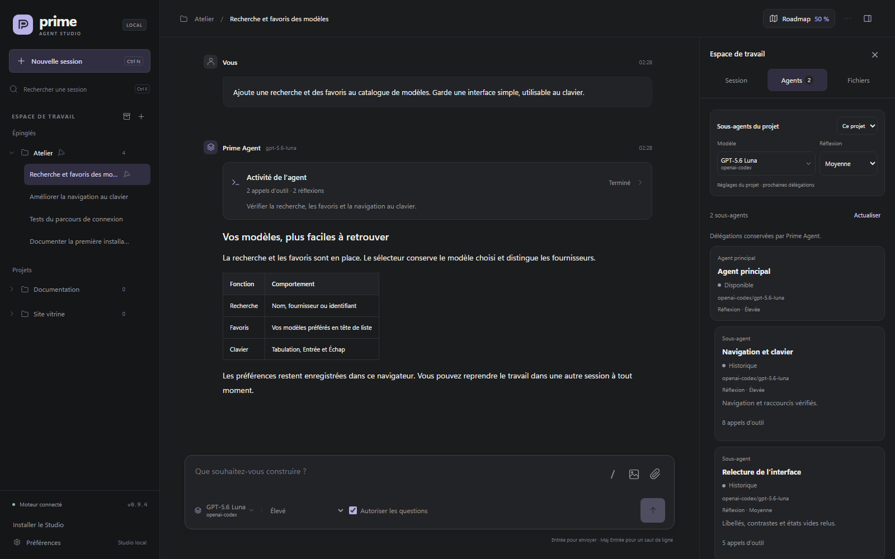

<p align="center"><em>Interface réelle du dépôt, contenus et mesures fictifs, services simulés. Les démonstrations sont traduites dans chaque langue.</em></p>

Prime Agent Studio réunit les sessions de votre **Prime Agent local** dans une application Windows et une interface accessible depuis le navigateur. Suivez les réponses en direct, retrouvez vos projets et continuez une conversation sans ouvrir de terminal. Sous Windows, les agents et leurs outils démarrent en arrière-plan, sans fenêtres PowerShell intempestives. Les exécutions continuent lorsque vous changez de session, rechargez la page ou fermez l’onglet ; le serveur doit rester en marche.

- **Suivez le direct** : réponses en streaming, réorientation en cours d’exécution et questions de l’agent, sans l’arrêter.
- **Gardez le cap** : Roadmap partagée avec les agents, juste à côté des conversations.
- **Travaillez d’où vous voulez** : le même Studio sur PC Windows et sur téléphone, en Wi-Fi ou hors Wi-Fi.

**Version 3.6.1** · [Télécharger l’installateur Windows x64](https://github.com/zerr0o/prime-agent-studio/releases/download/v3.6.1/Prime-Agent-Studio_3.6.1_x64-setup.exe) · [Historique des versions](docs/changelog.md).

## Démarrage rapide

### Application Windows

1. Téléchargez l’[installateur Windows x64](https://github.com/zerr0o/prime-agent-studio/releases/latest), installez-le, puis ouvrez **Prime Agent Studio** depuis le Bureau ou le menu Démarrer. Node.js est inclus.
2. Au premier lancement, choisissez **Installer les composants manquants** (Prime Agent **0.9.4**, npm privé, uv et Python, téléchargés à la demande après votre clic ; installations externes compatibles réutilisées, Git Bash détecté séparément) ou **Reprendre une installation existante** si vous utilisiez le VBS.
3. Configurez votre fournisseur, ajoutez un dossier de projet avec **+**, puis écrivez votre demande. [Guide complet](docs/desktop.md).

Les mises à jour sont signées pour Tauri ; l’installateur ne possède pas encore de signature Windows Authenticode.

**Après la mise à jour :** l’application peut continuer à utiliser l’ancien serveur pendant que les agents terminent leur travail. Une fois leurs exécutions terminées, utilisez **Préférences → Mise à jour → Redémarrer le serveur** dans l’application Windows pour activer la version 3.6.1. [Guide de mise à jour](docs/desktop.md#données-et-mises-à-jour).

<details>
<summary><strong>Depuis le code source</strong></summary>

**Prérequis :** Windows, **Node.js 22.8 ou ultérieur**, **uv** et **Prime Agent** installé. Configurez un fournisseur avant le premier message, depuis le CLI ou le panneau **Fournisseurs** du Studio sur le PC.

Téléchargez **Source code (zip)** depuis la [dernière release](https://github.com/zerr0o/prime-agent-studio/releases/latest) et extrayez l’archive, ou clonez ce dépôt. Ouvrez ensuite un terminal dans le dossier extrait :

```powershell
npm ci
npm run setup:runtime
npm run start:silent
```

Le navigateur s’ouvre sur **[127.0.0.1:3088](http://127.0.0.1:3088)**. Ensuite, un double-clic sur **`Lancer Prime Agent.vbs`** suffit : le lanceur réutilise le serveur s’il est déjà ouvert.

1. Ajoutez le dossier d’un projet avec **+** dans l’espace de travail.
2. Ouvrez une session existante ou choisissez **Nouvelle session**.
3. Sélectionnez votre modèle, puis écrivez votre demande.

Le Studio réutilise la configuration de Prime Agent : aucune clé API à coller dans le navigateur. La préparation initiale du moteur Python peut nécessiter une connexion Internet.

| Commande               | Utilité                                                             |
| ---------------------- | ------------------------------------------------------------------- |
| `npm run start:silent` | Démarrer en arrière-plan et ouvrir le navigateur.                   |
| `npm run shortcut`     | Créer un raccourci sur le Bureau.                                   |
| `npm start`            | Démarrer avec les journaux dans le terminal, pour le développement. |
| `npm run stop`         | Fermer le serveur et ses exécutions actives.                        |

**Fermer l’onglet laisse les agents travailler.** Le bouton **Arrêter** termine l’exécution sélectionnée ; `Arreter Prime Agent.vbs` ou `npm run stop` ferme tout le Studio.

</details>

<details>
<summary><strong>Mettre à jour une installation Git</strong></summary>

Attendez la fin des exécutions, puis lancez ces commandes dans le dossier du Studio :

```powershell
npm run stop
git pull --ff-only
npm ci
npm run setup:runtime
npm run start:silent
```

Vos réglages locaux et les sessions natives de Prime Agent sont conservés. Pour une installation depuis une archive, remplacez les fichiers du Studio par ceux de la nouvelle release en conservant le dossier `.local`, puis relancez les étapes d’installation.

</details>

## Sommaire

- [Un espace pour chaque projet](#un-espace-pour-chaque-projet) — sessions, recherche, import et export.
- [Roadmap du projet](#roadmap-du-projet) — plans, tâches et backlog partagés avec les agents.
- [Pendant que l’agent travaille](#pendant-que-lagent-travaille) — réorientation et messages à la suite.
- [Images, questions et pièces jointes](#images-questions-et-pièces-jointes) — visuels du projet et dialogue natif.
- [Vos modèles à portée de main](#vos-modèles-à-portée-de-main) — fournisseurs, favoris, réflexion et sous-agents.
- [Session, agents et fichiers](#session-agents-et-fichiers) — consommation, délégations et aperçus.
- [Commandes, skills et MCP](#commandes-skills-et-mcp) — catalogue slash et connexions d’outils.
- [Connaissances du projet](#connaissances-du-projet) — travaux passés, mémoires et refinements.
- [Aussi depuis votre téléphone](#aussi-depuis-votre-téléphone) — Wi-Fi, Tailscale et code d’accès.
- [Installer le Studio comme une application](#installer-le-studio-comme-une-application) — PWA mobile.
- [Application Windows et mises à jour](#application-windows-et-mises-à-jour) — composants, données et mises à jour signées.
- [Documentation](#documentation) · [Licence et attribution](#licence-et-attribution)

**Français ou English** : choisissez **Préférences → Apparence → Langue** sur PC ou mobile. Le mode **Automatique** suit la langue du navigateur. Le changement est immédiat, conserve les formulaires, brouillons et pièces jointes, et laisse les agents continuer. Les traductions sont réunies dans **une table unique**, avec repli sur le français en cas de texte manquant. [Ajouter une langue ou une traduction](docs/translations.md).

## Un espace pour chaque projet

Dépliez un projet dans la barre latérale pour retrouver ses conversations, filtrez les sessions archivées et gardez les échanges importants épinglés. Les conversations gardent un ordre stable, que vous pouvez réorganiser, et ne remontent plus à chaque message. Le menu **⋯** d’une conversation, également accessible par clic droit sur PC, permet de la renommer, de l’épingler, de l’archiver ou de l’exporter en Markdown. Le Studio propose les thèmes **sombre, clair et système**, des brouillons locaux et des raccourcis clavier.

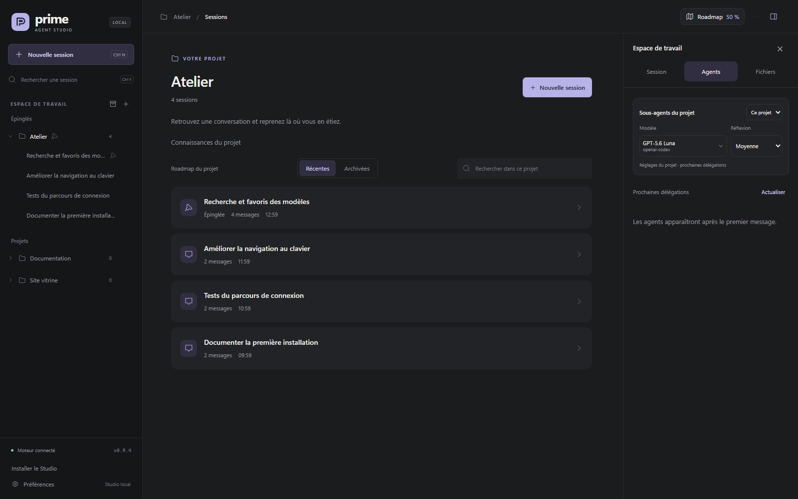

Dans la liste des projets, un **point vert** indique une session en cours et un **point bleu** une réponse terminée restant à lire ; le vert est prioritaire. La lecture est enregistrée sur le PC serveur et partagée entre navigateurs, téléphone et application Windows. Les appareils ouverts se synchronisent au prochain rafraîchissement (au plus 10 secondes), ou dès leur retour au premier plan.

Glissez un projet vers sa nouvelle position dans la liste. Sur écran tactile, utilisez sa poignée ; au clavier, placez le focus sur la poignée puis utilisez les flèches haut/bas. Le menu **⋯** propose aussi **Monter** et **Descendre**, y compris pour réordonner les conversations. L’ordre est enregistré sur le serveur et partagé entre appareils ; les projets épinglés restent en tête et se réordonnent dans leur groupe. Retirer un projet masque son entrée dans le Studio et conserve son dossier et ses sessions ; un projet avec une exécution active ne peut pas être retiré.

Le format `.pastudio` (v1) transfère des conversations complètes vers un autre projet existant, avec leurs sous-agents et la Roadmap. L’export et l’import se font depuis le Studio ouvert sur ce PC, pas depuis un navigateur distant. L’import est additif, sans rien effacer ; réimporter la même archive est détecté et ignoré. Les conversations importées arrivent déjà lues ; à la reprise, le modèle d’origine est conservé s’il est utilisable, sinon le modèle par défaut du PC est utilisé. Les fichiers du projet, réglages, clés, mémoires et moteur ne sont jamais inclus. Les historiques peuvent contenir des secrets : vérifiez le contenu avant de partager une archive. Limite d’archive : 128 Mio compressés (256 Mio non compressés au total, 128 Mio par entrée). [Guide d’import et d’export](docs/navigation.md#importer-et-exporter-des-conversations-pastudio).

<p align="center">
  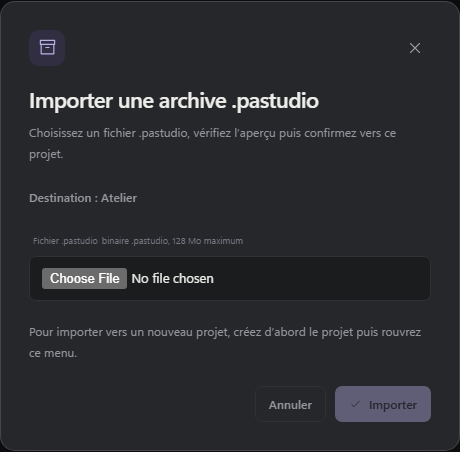
</p>

## Roadmap du projet

Gardez vos plans, tâches imbriquées et idées de backlog à côté des conversations. Agrandissez la Roadmap sur tout l’espace de travail, repliez les groupes de tâches et suivez leurs compteurs ; les descriptions restent discrètes jusqu’à leur ouverture.

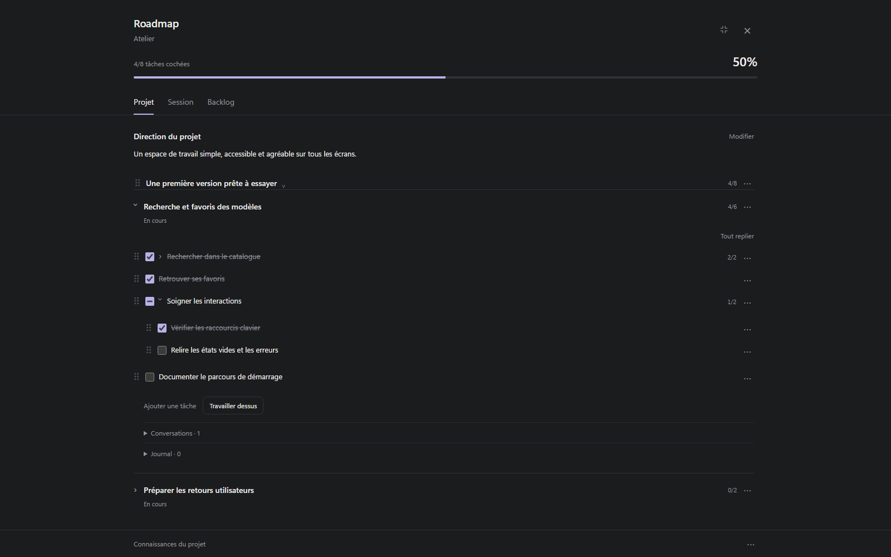

Le Studio et ses agents partagent la même Roadmap : lancez un travail depuis un plan, retrouvez sa conversation et consultez les connaissances du projet depuis le panneau. Les écritures sont atomiques avec révision attendue ; après un conflit, relisez avant de réappliquer. [Découvrir le guide Roadmap →](docs/roadmap.md)

## Pendant que l’agent travaille

Le champ de saisie reste disponible pendant une exécution. Choisissez le moment où votre message doit être pris en compte :

| Mode           | Quand le message est transmis                                           |
| -------------- | ----------------------------------------------------------------------- |
| **Réorienter** | Après les outils de l’étape courante, pour ajuster la demande en cours. |
| **À la suite** | Après la réponse courante, pour enchaîner avec une nouvelle demande.    |

Vous pouvez modifier vos messages en attente, les réordonner, les retirer ou les déplacer d’un mode à l’autre. Les messages automatiques entre agents portent la mention **Automatique · protégé** et ne proposent aucun contrôle de modification ou de suppression. Les messages reçus des sous-agents ont une carte dédiée avec leur nom et leur contenu.


## Images, questions et pièces jointes

Retrouvez les images du projet directement dans la réponse de l’agent et cliquez pour les agrandir. Le Studio lit le fichier d’origine sans en créer une copie ; s’il est déplacé ou supprimé, la conversation indique que l’image n’est plus disponible.

La case **Autoriser les questions**, près du niveau de réflexion, permet à l’agent de demander votre avis via le mécanisme interactif natif de Prime Agent. Sélectionnez une option, dépliez sa description, écrivez une autre réponse ou choisissez **Passer**. Elle est cochée par défaut ; chaque conversation conserve son choix, synchronisé entre PC et téléphone. Dans l’application Windows, **Préférences → Notifications** règle séparément les alertes pour les questions et les fins de tour, et le Studio reste silencieux lorsqu’une de ses fenêtres a le focus.


Deux boutons distincts accompagnent le champ de saisie : **Photo** ouvre le sélecteur d’images ; **Pièce jointe** accepte tout type de fichier. Vous pouvez aussi **glisser-déposer** les fichiers dans la conversation ou **coller** les images et documents reçus par le navigateur. Les aperçus permettent de retirer une pièce avant l’envoi, et les pièces du brouillon restent dans ce navigateur après un rechargement.


Les images **PNG, JPEG, GIF et WebP** sont transmises au moteur avec leurs pixels ; choisissez un modèle compatible avec les images. Les autres fichiers sont conservés sur le PC et leur chemin est transmis à Prime Agent pour ses outils.

| Par message | Nombre maximal | Taille par pièce | Taille cumulée |
| ----------- | -------------- | ---------------- | -------------- |
| Images      | 4              | 4 Mo             | 8 Mo           |
| Fichiers    | 8              | 10 Mo            | 20 Mo          |

Vous pouvez combiner images et fichiers, dans la limite de **8 pièces jointes au total**. Les fichiers envoyés sont conservés sur le PC ; les brouillons appartiennent au navigateur dans lequel vous les préparez.

## Vos modèles à portée de main

Sur le PC, **Préférences → Modèles et agents → Gérer les connexions** permet de connecter les comptes pris en charge par Prime Agent, d’ajouter ou remplacer une clé API et de retirer des identifiants avec confirmation. Ce panneau reste réservé à l’adresse locale du PC ; les routes correspondantes sont bloquées à distance. **Configuré** signifie qu’un moyen d’authentification a été trouvé, sans requête de génération de vérification. Le [guide des fournisseurs](docs/providers.md) détaille les parcours de connexion et le comportement pendant les sessions actives.

<p align="center">
  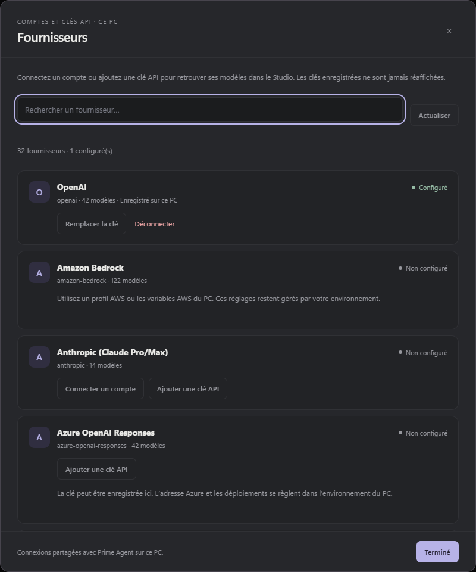
</p>

Recherchez un modèle par son **nom, son fournisseur ou son identifiant**. Les favoris restent en tête du sélecteur et sont enregistrés dans votre navigateur. Le catalogue dépend des modèles disponibles dans votre installation Prime Agent ; les choix de modèle et de réflexion sont propres à chaque conversation. La réflexion peut changer pendant le travail de l’agent : le nouveau niveau s’applique aux prochains appels du modèle sans interrompre l’outil en cours. Selon le modèle, les niveaux proposés vont de `off` à `max` (`minimal`, `low`, `medium`, `high`, `xhigh`) : seuls les niveaux pris en charge par le modèle sont sélectionnables.

<p align="center">
  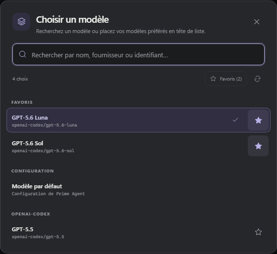
</p>

**Nouvelle session** reprend le modèle principal par défaut, configurable sur le PC avec le même sélecteur. Avec Prime Agent **0.9.4**, la zone **Sous-agents** définit les valeurs globales ; pour un projet précis, choisissez **Ce projet** en haut de l’onglet **Agents**, même avant le premier message. Chaque valeur peut hériter du parent, et les sous-agents déjà créés conservent leurs réglages.

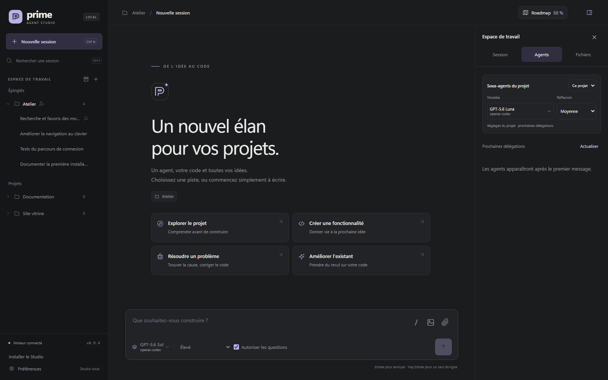

Dans **Préférences → Raisonnement de l’agent**, choisissez **Masqué**, **Aperçu** ou **Détaillé** : l’aperçu affiche les deux dernières lignes de la dernière réflexion, avec suivi automatique pendant la génération. Si un compte Codex est connecté via OAuth, un bloc **Quota Codex (optionnel)** affiche les fenêtres courte et hebdomadaire avec leur réinitialisation : consultation manuelle par **Actualiser le quota** uniquement. Sans compte lié (par exemple un usage via clé API), le bloc l’indique sans chiffres. [Consulter le guide des modèles et de la configuration →](docs/configuration.md)

## Session, agents et fichiers

Le panneau de droite propose trois onglets : **Session** pour l’état, les tokens et l’accès aux **Connaissances du projet**, **Agents** pour les délégations et leurs échanges, **Fichiers** pour parcourir le projet ou consulter les changements Git. Sur téléphone, le bouton de panneau en haut à droite ouvre ces vues en pleine hauteur. Fermer le panneau conserve la session et son brouillon.

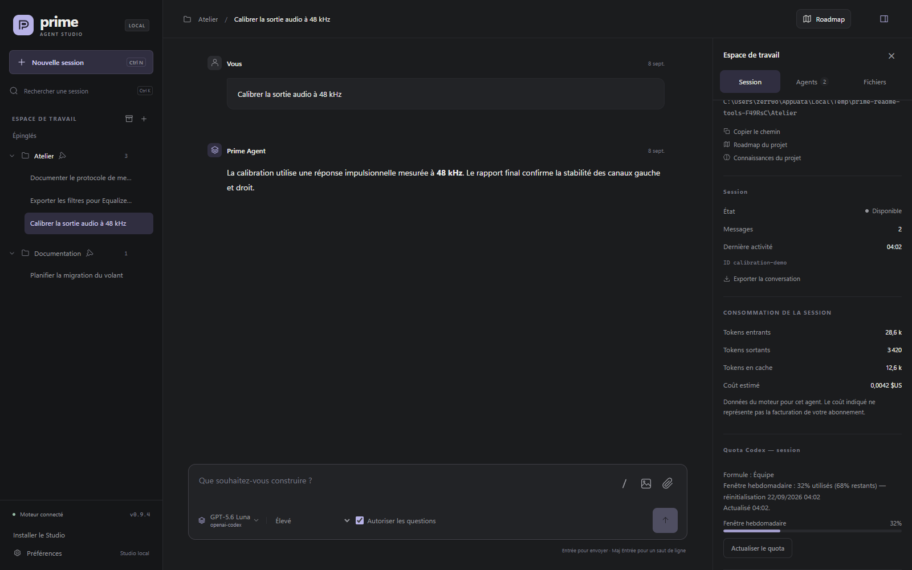

La consommation additionne les données enregistrées par Prime Agent sur la branche actuelle : tokens entrants, sortants et en cache. Le coût estimé apparaît uniquement si le moteur le fournit ; il ne correspond pas à la facturation de votre abonnement. Ces totaux concernent l’agent principal, pas l’ensemble de ses délégations. L’onglet **Agents** présente la hiérarchie avec modèle, niveau de réflexion et état ; cliquer sur une carte ouvre ses échanges sans arrêter ni détacher l’agent.

Les fichiers s’affichent en lecture seule, avec un rendu Markdown, du JSON indenté et une bascule **Aperçu / Source**. Les liens vers des documents dans la conversation ouvrent le même visualiseur. **Ouvrir** lance le fichier dans son application sur le PC ; depuis le téléphone, le bouton indique **Ouvrir sur le PC**. Les changements Git concernent tout le projet, y compris le travail d’autres sessions. Les aperçus acceptent les textes jusqu’à 512 Kio et les images jusqu’à 8 Mio. Le [guide du panneau](docs/inspector.md) détaille le suivi en direct et les limites des aperçus.

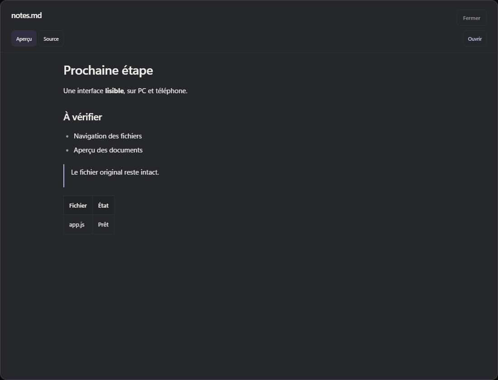

## Commandes, skills et MCP

Tapez **`/`** ou utilisez le bouton **/** près des pièces jointes pour rechercher une commande, un skill ou un prompt du projet. Une commande validée devient un **chip coloré** dans le champ : violet pour un skill, bleu pour une commande, vert pour un prompt. Les raccourcis ouvrent les panneaux du Studio ; `/compact`, `/refine`, `/goal` et `/autonomous` sont exécutés par Prime Agent, y compris dans la file d’une session active. `/skill:nom` charge un skill avec vos consignes. Les commandes propres au terminal sont visibles dans l’onglet **Terminal** et ne sont jamais envoyées silencieusement au modèle.

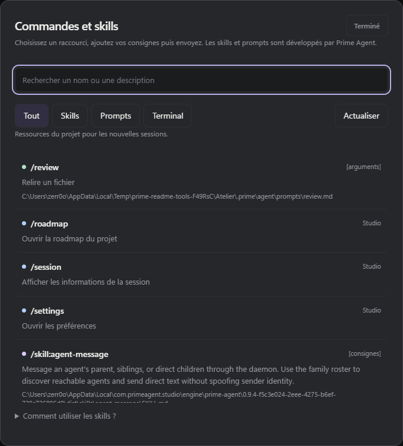

Les skills Python sont préparées selon les réglages natifs du projet, pour le parent comme pour ses sous-agents. En cas d’installation ancienne incomplète, lancez `npm run setup:runtime` sur le PC puis redémarrez le Studio. Si `PRIME_AGENT_KERNEL_PYTHON` est défini, vous gérez ses packages : le Studio n’y installe rien et signale les imports manquants. [Guide des commandes, skills et prompts →](docs/commands.md)

**Préférences → Outils → Gérer les MCP** permet d’ajouter, modifier, tester, activer ou supprimer des connexions natives de Prime Agent. Les serveurs **HTTP** et **stdio** sont pris en charge, avec les connexions **OAuth** (réalisables aussi depuis un téléphone), les variables d’environnement et les restrictions d’outils. Linear et Notion sont proposés comme intégrations natives. Les tests découvrent les outils sans les exécuter ; les nouveaux réglages s’appliquent aux nouvelles sessions. [Guide MCP →](docs/mcp.md)

<p align="center">
  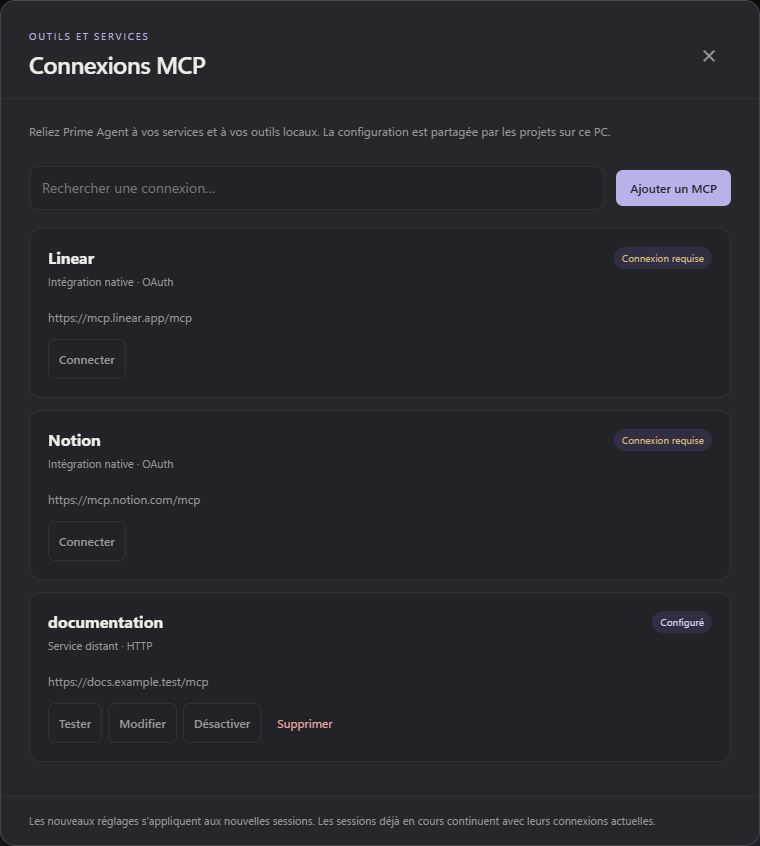
</p>

## Connaissances du projet

- **Rechercher** quelques mots d’une décision ou d’un problème, puis filtrer par **Travaux passés**, **Mémoires** ou **Refinements** (mention **Global** pour les éléments partagés). La recherche est textuelle, sans appel à un modèle : elle ignore la casse et les accents.
- **Lire la source exacte** de chaque résultat, avec ses dates natives et ses modifications avant/après quand elles ont été enregistrées.
- **Réutiliser avec un agent** : les nouvelles exécutions reçoivent les outils `studio_knowledge_search` et `studio_knowledge_read`, hérités par leurs sous-agents, pour vérifier une solution passée avant de l’appliquer.

La consultation ne modifie ni mémoires, ni refinements, ni conversations, et ne repose sur aucun second moteur de mémoire.

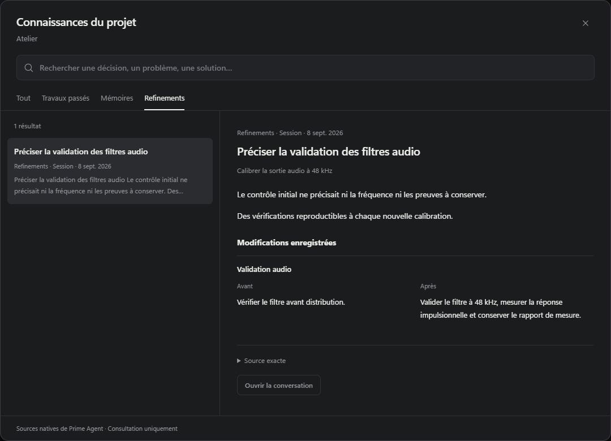

[Guide des connaissances →](docs/knowledge.md)

## Aussi depuis votre téléphone

Sur le PC, ouvrez **Préférences → Accès distant** et activez **Réseau local**. Le changement s’applique immédiatement, sans redémarrer ni interrompre les agents. À la première activation, notez le PIN à huit chiffres affiché une seule fois ; les activations suivantes le conservent. Connectez le téléphone au même réseau, puis utilisez **Copier le lien** ou le **QR code** : le QR contient uniquement l’adresse, le PIN est demandé à la connexion. Le cookie de connexion dure huit heures.

<p align="center">
  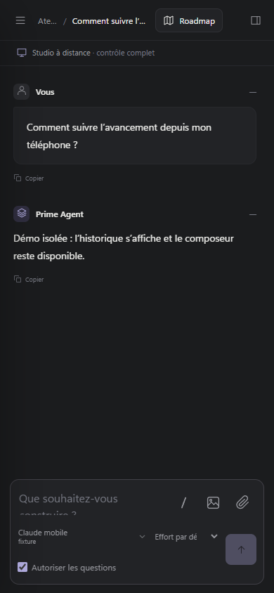
</p>

<p align="center">
  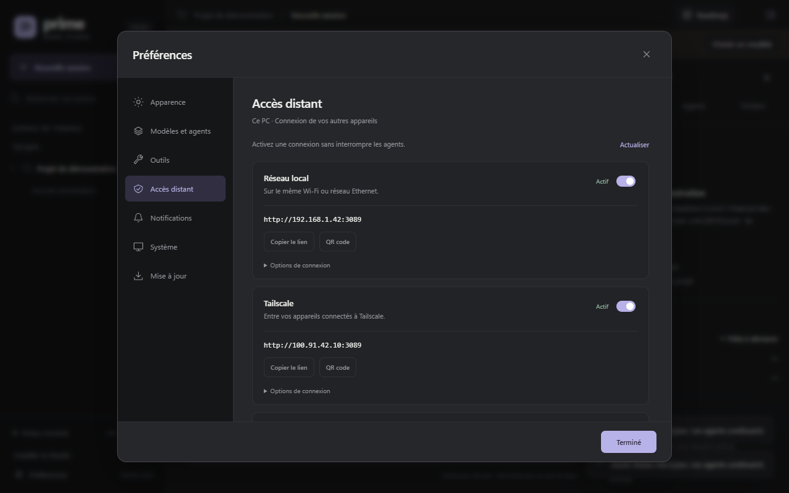
</p>

Vous pouvez créer ou reprendre une session, envoyer des messages et suivre le travail en direct ; le PC exécute les agents et doit rester allumé. Le port mobile par défaut est `3089`, commun au LAN et à Tailscale ; le port `3088` reste réservé au PC. La connexion LAN utilise HTTP sur votre réseau local : le Studio n’est pas destiné à être exposé sur Internet. L’accès distant est en **lecture seule** par défaut et passe en contrôle complet avec `readOnly: false` ; les appareils doivent alors se reconnecter.

Sur le PC, **Préférences → Accès distant → Changer le code** modifie le PIN à huit chiffres commun au Wi-Fi, à Tailscale et à la PWA (un zéro initial est accepté). Le code n’est conservé ni en clair sur le PC, ni dans le stockage du navigateur ; les appareils doivent se reconnecter avec le nouveau code, sans redémarrage du Studio. Pour accéder au Studio **hors du Wi-Fi, en 4G/5G**, connectez le PC et le téléphone au même réseau Tailscale, puis activez **Tailscale** dans la même rubrique. [Configurer le LAN, Tailscale, le code et le mode lecture seule →](docs/lan.md)

## Installer le Studio comme une application

Le Studio est une **PWA installable**. Avec Tailscale connecté sur le PC et le téléphone, ouvrez **Préférences → Accès distant** sur le PC et activez **Tailscale HTTPS**. L’activation conserve votre code d’accès et affiche une adresse `https://nom-du-pc.nom-du-reseau.ts.net`, sans redémarrage ni interruption des agents. Ouvrez ce lien dans le navigateur du téléphone et utilisez **Installer le Studio**. Sur iPhone, passez par **Safari → Partager → Sur l’écran d’accueil**.

La PWA conserve les commandes et pièces jointes du site ; les brouillons restent stockés par appareil et par adresse. En cas de coupure, un écran **Réessayer** permet de retrouver la connexion. Le PC reste nécessaire pour exécuter les agents ; fermer l’application les laisse travailler. La passerelle Tailscale Serve transmet en local au port **3090** sur `127.0.0.1` et aucune ouverture publique n’est configurée. [Installation Android, iPhone et PC, HTTPS et fonctionnement hors ligne →](docs/pwa.md)

**Notifications mobiles (PWA fermée) :** **Préférences → Notifications → Notifications mobiles** active les alertes **Questions** et **Fins de tour** sur cet appareil, désactivées par défaut. Le serveur envoie une notification générique chiffrée, sans projet ni contenu de question ; un clic rouvre la session concernée. Prérequis : PWA installée depuis l’adresse HTTPS Tailscale, notifications autorisées, PC allumé avec serveur actif, Tailscale connecté des deux côtés. Sur iPhone/iPad : iOS 16.4 ou ultérieur, application ajoutée via **Safari → Partager → Sur l’écran d’accueil**, ouverte depuis l’icône, puis autorisation des notifications.

<p align="center">
  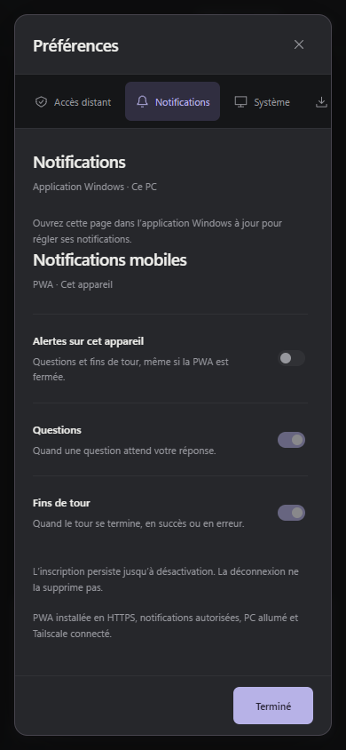
</p>

## Application Windows et mises à jour

L’application, construite avec Tauri 2, ouvre le Studio dans une fenêtre Windows dédiée et lance le serveur discrètement. **Fermer la fenêtre** la masque en conservant l’icône près de l’horloge : agents, serveur et accès mobiles continuent. **Démarrer avec Windows**, désactivé par défaut, lance le Studio en arrière-plan à votre connexion.

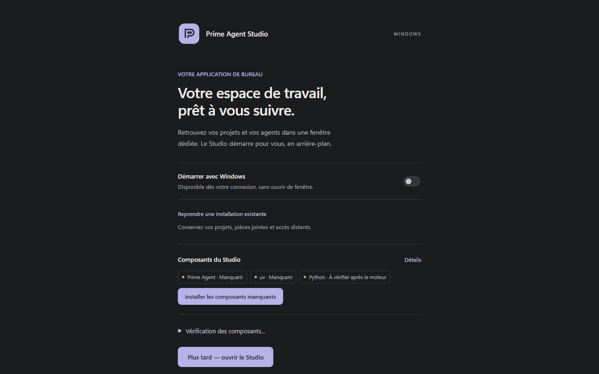

Les builds incluant la préparation guidée associent Studio 3.6.1 à **Prime Agent 0.9.4**, **npm 10.9.4** et **uv 0.8.22**, avec Python 3.11. Les archives sont contrôlées contre leurs inventaires et empreintes avant validation ; aucun composant externe détecté automatiquement n’est exécuté sans votre choix explicite. Les composants résident dans le dossier de données, sous `engine/`, avec les noyaux Python dans `.local`.

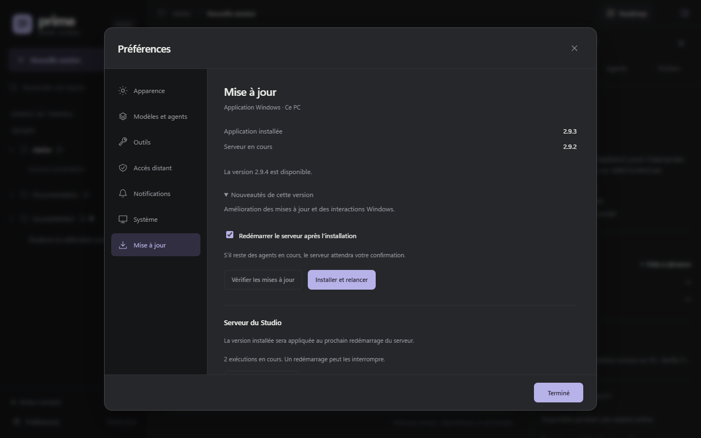

- **Données** : dossier `%LOCALAPPDATA%\com.primeagent.studio` (projets, pièces jointes, PIN haché, réseau, journaux, noyaux Python, copies du serveur). Une mise à jour prépare une nouvelle copie du serveur ; **Préférences → Mise à jour** distingue la version installée de la version active.
- **Depuis un téléphone** (accès en écriture) : le pilotage d’une mise à jour reste soumis aux mêmes conditions — application Windows active et aucun agent en cours ; l’installation et le redémarrage s’exécutent côté Windows. Le pilotage courant (messages, sessions, projets) reste entièrement disponible sur mobile.

Dans le Studio, ouvrez **Préférences → Mise à jour → Vérifier les mises à jour** : cette vérification est manuelle, sans interrogation périodique en arrière-plan. Si une version stable plus récente est publiée sur GitHub, ses nouveautés et le bouton **Installer et relancer** apparaissent. Le téléchargement affiche sa progression, puis Tauri vérifie la signature avant de lancer l’installation ; aucune installation ne démarre sans ce clic. Une erreur réseau, un catalogue absent ou une signature invalide ne sont jamais présentés comme « à jour ». L’option **Redémarrer le serveur après l’installation** applique la nouvelle version si aucun agent ne travaille ; sinon, le serveur reste actif et **Redémarrer le serveur** affiche une confirmation, car le redémarrage peut interrompre les exécutions. [Guide de l’application Windows →](docs/desktop.md)

## Documentation

| Guide                                             | Contenu                                                                             |
| ------------------------------------------------- | ----------------------------------------------------------------------------------- |
| [Configuration et données](docs/configuration.md) | Modèles, valeurs par défaut, stockage et variables d’environnement.                 |
| [Projets et conversations](docs/navigation.md)    | Projets dépliables, recherche, archives, menus et réorganisation.                   |
| [Connaissances du projet](docs/knowledge.md)      | Travaux passés, mémoires natives, refinements et outils d’historique des agents.    |
| [Roadmap du projet](docs/roadmap.md)              | Plans partagés, checklists, backlog, outils natifs et liens vers les conversations. |
| [Fournisseurs](docs/providers.md)                 | Connexions par compte, clés API, déconnexion et accès réservé au PC.                |
| [Accès mobile](docs/lan.md)                       | Activation, adresse réseau, authentification et permissions.                        |
| [Application installable](docs/pwa.md)            | Installation PWA, HTTPS privé et reconnexion.                                       |
| [Application Windows](docs/desktop.md)            | Fenêtre Windows, composants, données et mises à jour.                               |
| [Développement](docs/development.md)              | Architecture, processus Windows silencieux, tests et captures reproductibles.       |
| [Agents et fichiers](docs/inspector.md)           | Sous-agents, consommation, changements Git, aperçus et ouverture des documents.     |
| [Commandes et skills](docs/commands.md)           | Commandes natives, raccourcis, skills et prompts du projet.                         |
| [Connexions MCP](docs/mcp.md)                     | Serveurs, OAuth, outils autorisés et diagnostic des connexions.                     |
| [Langues et traductions](docs/translations.md)    | Traductions de l’interface et maintien des deux langues de documentation.           |

Pour vérifier le projet :

```powershell
npm run check
npm test
npm run test:ui
npm run test:mobile
npm run test:attachments
npm run test:pwa
npm run test:inspector
npm run test:providers
```

Les tests automatiques utilisent des données temporaires et un moteur simulé.

## Licence et attribution

Prime Agent Studio est développé par **[zerr0o](https://github.com/zerr0o)** et distribué sous [licence MIT](LICENSE). Copyright © 2026 zerr0o.

Vous pouvez utiliser, modifier et redistribuer ce projet, y compris à des fins commerciales, en conservant la mention de copyright de **zerr0o** et le texte de la licence dans les copies ou portions substantielles du logiciel. Le fichier [LICENSE](LICENSE) reprend le [texte standard de la licence MIT](https://opensource.org/license/mit).

Prime Agent et les dépendances tierces conservent leurs licences respectives.

---

<p align="center">
  <strong>Prime Agent Studio</strong><br>
  Une interface locale autour de Prime Agent, avec vos sessions et votre configuration existantes.
</p>
