<p align="center">
  
</p>

<h1 align="center">Prime Agent Studio</h1>

<p align="center"><strong>English</strong> · <a href="README.fr.md" lang="fr">Français</a></p>

<p align="center">
  <a href="https://github.com/zerr0o/prime-agent-studio/releases/latest"></a>
  <a href="https://github.com/zerr0o/prime-agent-studio/stargazers"></a>
  <a href="LICENSE"></a>
  <a href="#quick-start"></a>
  <a href="#quick-start"></a>
</p>

<p align="center">
  <strong>Your projects. Your agents. One workspace.</strong><br>
  A local French and English interface for Prime Agent, designed for Windows.
</p>

<p align="center">
  <a href="https://github.com/zerr0o/prime-agent-studio/releases/latest"><strong>Download for Windows</strong></a> ·
  <a href="#quick-start">Quick start</a> ·
  <a href="#documentation">Documentation</a> ·
  <a href="docs/en/changelog.md">What's new</a>
</p>

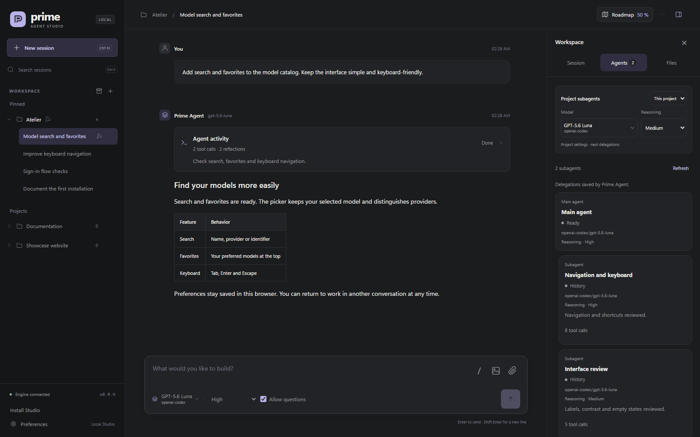

<p align="center"><em>Real repository interface, fictional contents and measurements, simulated services. Demonstrations are translated in each language.</em></p>

Prime Agent Studio brings your **local Prime Agent sessions** together in a Windows application and a browser interface. Follow streaming responses, find your projects and continue a conversation without opening a terminal. On Windows, agents and their tools run in the background, without unexpected PowerShell windows. Runs continue when you switch sessions, reload the page or close the tab; the server must stay running.

- **Follow live work**: streaming responses, mid-run steering and agent questions, without stopping it.
- **Stay on course**: a Roadmap shared with agents, right beside conversations.
- **Work from anywhere**: the same Studio on a Windows PC and on your phone, over Wi-Fi or beyond.

**Version 3.8.0** · [Download the Windows x64 installer](https://github.com/zerr0o/prime-agent-studio/releases/download/v3.8.0/Prime-Agent-Studio_3.8.0_x64-setup.exe) · [Release history](docs/en/changelog.md).

## Quick start

### Windows application

1. Download the [Windows x64 installer](https://github.com/zerr0o/prime-agent-studio/releases/latest), install it, then open **Prime Agent Studio** from your desktop or Start menu. Node.js is included.
2. At first launch, choose **Repair Studio** (Prime Agent **0.9.5**, private npm, uv and Python, downloading on demand after your click; compatible external installations reused, Git Bash detected separately) or **Use an existing installation** if you used the VBS launcher.
3. Configure your provider, add a project folder with **+**, then write your request. [Full guide](docs/en/desktop.md).

Updates are signed for Tauri; the installer does not yet carry a Windows Authenticode signature.

**After updating:** open **Preferences → Updates → Restart now** to start the installed server version. Restart is explicit: confirmation explains which active agents and interruptible operations will stop. **Repair Studio** prepares missing components without restarting. [Update guide](docs/en/desktop.md#data-and-updates).

<details>
<summary><strong>From source</strong></summary>

**Requirements:** Windows, **Node.js 22.8 or later**, **uv**, and **Prime Agent** installed. Configure a provider before the first message, through the CLI or Studio's desktop **Providers** panel.

Download **Source code (zip)** from the [latest release](https://github.com/zerr0o/prime-agent-studio/releases/latest) and extract it, or clone this repository. Open a terminal in the extracted folder:

```powershell
npm ci
npm run setup:runtime
npm run start:silent
```

The browser opens at **[127.0.0.1:3088](http://127.0.0.1:3088)**. Afterward, double-click **`Lancer Prime Agent.vbs`**: the launcher reuses the server if it is already running.

1. Add a project folder with **+** in the workspace.
2. Open an existing session or choose **New session**.
3. Select a model, then write your request.

Studio reuses Prime Agent's configuration: you do not need to paste an API key into the browser. Initial Python engine setup may require an Internet connection.

| Command                | Purpose                                           |
| ---------------------- | ------------------------------------------------- |
| `npm run start:silent` | Start in the background and open the browser.     |
| `npm run shortcut`     | Create a desktop shortcut.                        |
| `npm start`            | Start with logs in the terminal, for development. |
| `npm run stop`         | Close the server and its active runs.             |

**Closing the tab lets agents keep working.** The **Stop** button ends the selected run; `Arreter Prime Agent.vbs` or `npm run stop` closes all of Studio.

</details>

<details>
<summary><strong>Updating a Git installation</strong></summary>

Wait for runs to finish, then run these commands in the Studio folder:

```powershell
npm run stop
git pull --ff-only
npm ci
npm run setup:runtime
npm run start:silent
```

Your local settings and Prime Agent's native sessions are preserved. For an archive installation, replace Studio's files with those of the new release while keeping the `.local` folder, then repeat the installation steps.

</details>

## Contents

- [A space for every project](#a-space-for-every-project) — sessions, search, import and export.
- [Project roadmap](#project-roadmap) — plans, tasks and backlog shared with agents.
- [While the agent is working](#while-the-agent-is-working) — steering and follow-up messages.
- [Images, questions and attachments](#images-questions-and-attachments) — project visuals and native dialogue.
- [Your models within reach](#your-models-within-reach) — providers, favorites, reasoning and subagents.
- [Session, agents and files](#session-agents-and-files) — usage, delegations and previews.
- [Commands, skills and MCP](#commands-skills-and-mcp) — slash catalog and tool connections.
- [Project knowledge](#project-knowledge) — past work, memories and refinements.
- [Also from your phone](#also-from-your-phone) — Wi-Fi, Tailscale and access code.
- [Install Studio as an app](#install-studio-as-an-app) — mobile PWA.
- [Windows application and updates](#windows-application-and-updates) — components, data and signed updates.
- [Documentation](#documentation) · [License and attribution](#license-and-attribution)

**Français or English**: open **Preferences → Appearance → Language** on desktop or mobile. **Automatic** follows the browser's language. Changes apply immediately, preserve forms, drafts and attachments, and let agents keep working. Translations live in **one table**, falling back to French for missing text. [Add a language or translation](docs/en/translations.md).

## A space for every project

Expand a project in the sidebar to find its conversations, filter archived sessions and keep important exchanges pinned. Conversations keep a stable order that you can rearrange, and no longer jump with every message. Each conversation's **⋯** menu, also available with right-click on desktop, renames, pins, archives or exports it as Markdown. Studio offers **dark, light and system** themes, local drafts and keyboard shortcuts.

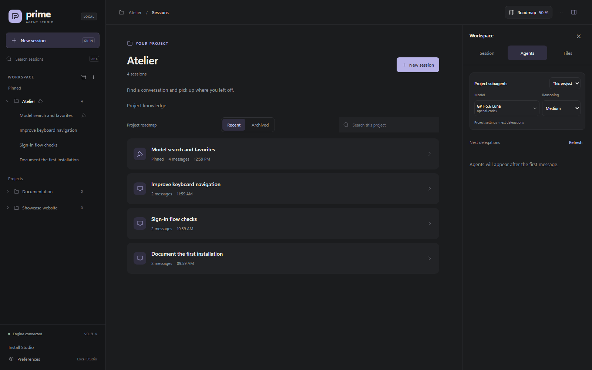

In the project list, a **green dot** indicates a working session and a **blue dot** an unread completed response; green takes priority. Read receipts are saved on the host PC and shared across browsers, phones and the Windows application. Open devices synchronize at the next refresh (within 10 seconds), or when brought back to the foreground.

Drag a project to its new position in the list. On touchscreens, use its handle; with the keyboard, focus the handle and use the up/down arrows. The **⋯** menu also offers **Move up** and **Move down**, including for reordering conversations. The order is saved on the server and shared across devices; pinned projects stay at the top and can be reordered within their group. Removing a project hides its Studio entry while preserving its folder and sessions; a project with an active run cannot be removed.

The `.pastudio` format (v1) transfers complete conversations to another existing project, with their subagents and Roadmap. Export and import happen from Studio opened on that PC, not from a remote browser. Import is additive and never deletes anything; reimporting the same archive is detected and ignored. Imported conversations arrive already read; on resume, the source model is kept when usable, otherwise the PC default model is used. Project files, settings, keys, memories and the engine are never included. Histories may contain secrets: review the content before sharing an archive. Archive limit: 128 MiB compressed (256 MiB uncompressed total, 128 MiB per entry). [Import and export guide](docs/en/navigation.md#import-and-export-conversations-pastudio).

<p align="center">
  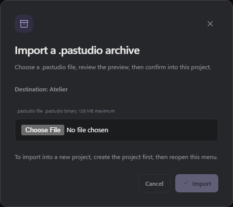
</p>

## Project roadmap

Keep plans, nested tasks and a backlog alongside your conversations. Expand the Roadmap across the workspace, collapse task groups and track their checked/total counts; descriptions stay tucked away until you need them.

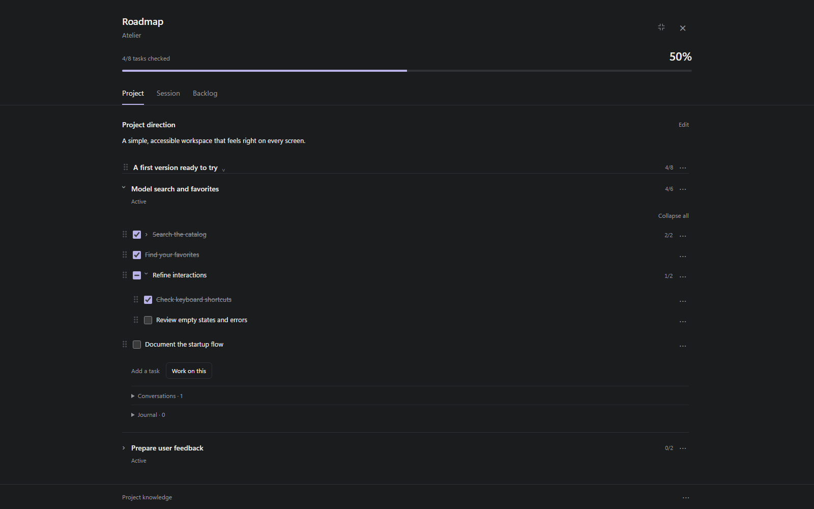

Studio and its agents share the same Roadmap: assign work from a plan, return to its linked conversation and consult project knowledge from the panel. Edits are atomic with an expected revision; after a conflict, read again before reapplying. [Explore the Roadmap guide →](docs/en/roadmap.md)

## While the agent is working

The input field stays available during a run. Choose when your message should be taken into account:

| Mode          | When the message is delivered                                  |
| ------------- | -------------------------------------------------------------- |
| **Steer**     | After the current step's tools, to adjust the ongoing request. |
| **Follow-up** | After the current response, to continue with a new request.    |

You can edit queued messages, reorder them, remove them or move them from one mode to the other. Automatic messages between agents are labeled **Automatic · protected** and offer no edit or delete controls. Messages received from subagents have a dedicated card with their name and content.


## Images, questions and attachments

See project images directly in the agent's response and click to enlarge them. Studio reads the original file without making an extra copy; if it is moved or deleted, the conversation shows that the image is no longer available.

**Allow questions**, beside the thinking selector, lets the agent ask for your input through Prime Agent's native interaction mechanism. Choose an option, expand its description, write another answer or **Skip**. It is enabled by default; each conversation keeps its own choice, synchronized between PC and phone. In the Windows application, **Preferences → Notifications** independently controls alerts for questions and completed turns, and Studio stays silent while any of its windows is focused.


Two separate buttons sit beside the input field: **Photo** opens the image picker; **Attachment** accepts any file type. You can also **drag and drop** files into the conversation or **paste** images and documents the browser receives from the clipboard. Previews let you remove an item before sending, and draft attachments stay in that browser after a reload.


**PNG, JPEG, GIF and WebP** images are sent to the engine with their pixels; choose an image-capable model. Other files are kept on the PC and their path is passed to Prime Agent for its tools.

| Per message | Maximum count | Size per item | Combined size |
| ----------- | ------------- | ------------- | ------------- |
| Images      | 4             | 4 MB          | 8 MB          |
| Files       | 8             | 10 MB         | 20 MB         |

You can combine images and files, up to **8 attachments in total**. Uploaded files are kept on the PC; drafts belong to the browser in which you prepare them.

## Your models within reach

On the PC, **Preferences → Models & agents → Manage connections** connects Prime Agent-supported accounts, adds or replaces an API key, and removes credentials with confirmation. This panel is restricted to the PC's local address; the corresponding routes are blocked remotely. **Configured** means an authentication method was found, with no probe generation request. The [providers guide](docs/en/providers.md) details connection flows and behavior during active sessions.

<p align="center">
  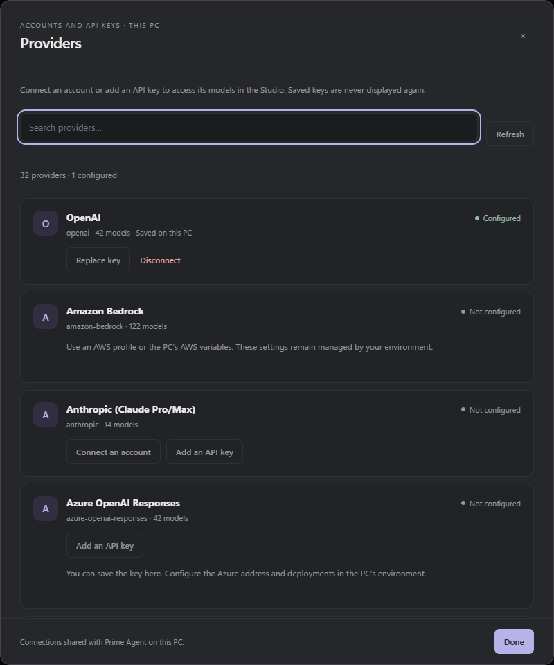
</p>

Search for a model by **name, provider or identifier**. Favorites stay at the top of the selector and are saved in your browser. The catalog depends on the models available in your Prime Agent installation; model and reasoning choices belong to each conversation. Reasoning can change while the agent works: the new level applies to the model's next calls without interrupting the current tool. Depending on the model, the offered levels range from `off` to `max` (`minimal`, `low`, `medium`, `high`, `xhigh`): only the levels supported by the model can be selected.

<p align="center">
  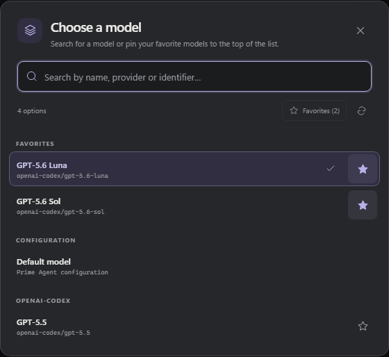
</p>

**New session** reuses the default main model, configurable on the PC with the same selector. With Prime Agent **0.9.5**, the **Subagents** area defines global values; for a specific project, choose **This project** at the top of the **Agents** tab, even before the first message. Each value can inherit from its parent, and already-created subagents keep their settings.

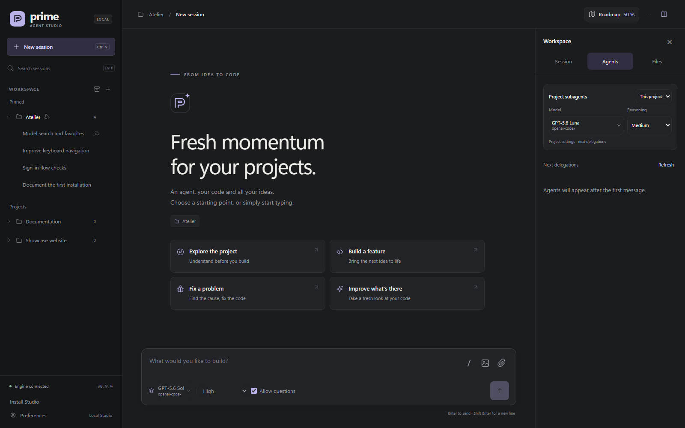

Under **Preferences → Agent reasoning**, choose **Hidden**, **Preview** or **Detailed**: preview shows the last two lines of the latest thinking, tracking automatically during generation. When a Codex account is connected via OAuth, a **Codex quota (optional)** block shows the short and weekly windows with their reset: manual **Refresh quota** checks only. Without a linked account (for example API-key usage), the block says so without figures. [Models and configuration guide →](docs/en/configuration.md)

## Session, agents and files

The right panel has three tabs: **Session** for status, token usage and access to **Project knowledge**, **Agents** for delegations and their conversations, and **Files** for browsing the project or reading Git changes. On phones, the panel button at the top right opens these views at full height. Closing the panel preserves the session and its draft.

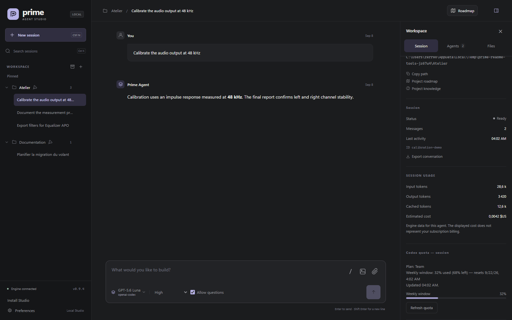

Usage totals the data Prime Agent recorded on the current branch: incoming, outgoing and cached tokens. A cost estimate appears only if the engine provides one; it does not match your subscription billing. These totals cover the main agent, not all of its delegations. The **Agents** tab shows the hierarchy with model, reasoning level and status; opening a card reads its exchanges without stopping or detaching the agent.

Files open read-only, with Markdown rendering, indented JSON and a **Preview / Source** switch. Document links in conversations open the same viewer. **Open** launches the file in its application on the PC; on phones, the button says **Open on PC**. Git changes cover the entire project, including work from other sessions. Previews accept text up to 512 KiB and images up to 8 MiB. The [panel guide](docs/en/inspector.md) explains live tracking and preview limits.

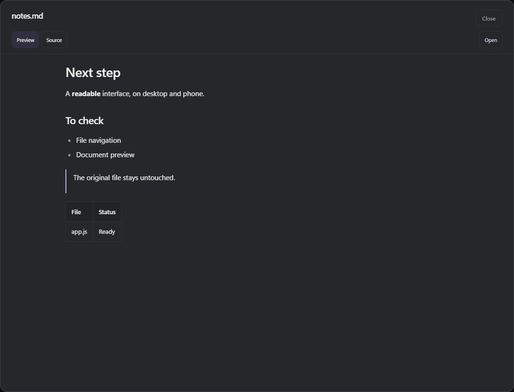

## Commands, skills and MCP

Type **`/`** or use the **/** button beside attachments to find a command, skill or project prompt. A confirmed command becomes a **colored chip** in the field: purple for a skill, blue for a command, green for a prompt. Shortcuts open Studio panels; `/compact`, `/refine`, `/goal` and `/autonomous` run through Prime Agent, including in an active session's queue. `/skill:name` loads a skill with your instructions. Terminal-only commands appear in the **Terminal** tab and are never sent silently to the model.

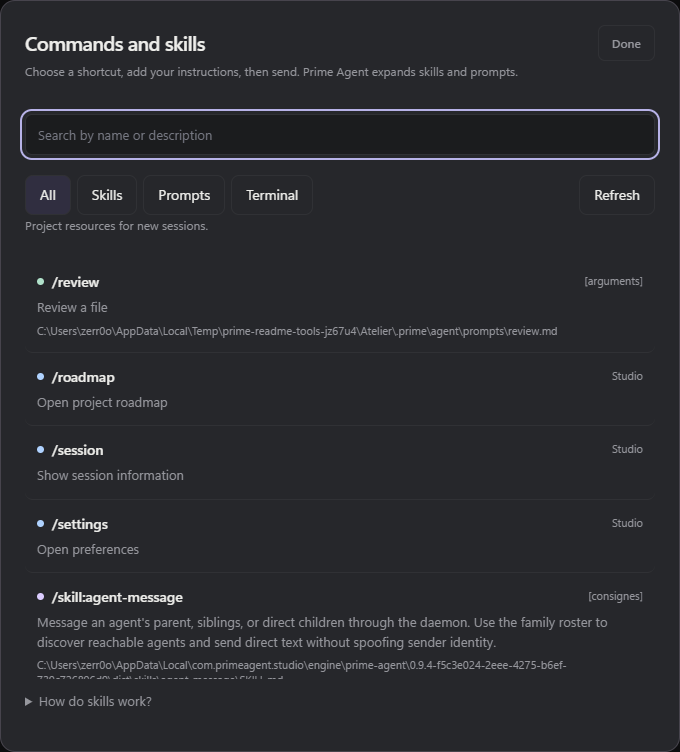

Python skills are prepared according to the project's native settings, for both the parent and its subagents. For an older incomplete installation, run `npm run setup:runtime` on the PC, then restart Studio. If `PRIME_AGENT_KERNEL_PYTHON` is set, you manage its packages: Studio installs nothing there and reports missing imports. [Commands, skills and prompts guide →](docs/en/commands.md)

**Preferences → Tools → Manage MCPs** lets you add, edit, test, enable or remove native Prime Agent connections. **HTTP** and **stdio** servers are supported, along with **OAuth** (which can also be completed from a phone), environment variables and tool restrictions. Linear and Notion are offered as native integrations. Tests discover tools without executing them; new settings apply to new sessions. [MCP guide →](docs/en/mcp.md)

<p align="center">
  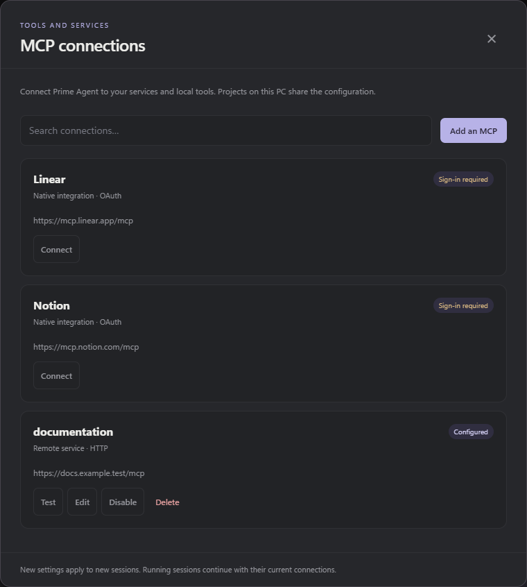
</p>

## Project knowledge

- **Search** a few words of a decision or problem, then filter by **Past work**, **Memories** or **Refinements** (**Global** for shared items). Search is textual, with no model call: it ignores case and accents.
- **Read the exact source** of each result, with its native dates and before/after changes when recorded.
- **Reuse with an agent**: new runs receive the `studio_knowledge_search` and `studio_knowledge_read` tools, inherited by their subagents, to verify a past solution before applying it.

Reading changes neither memories, refinements nor conversations, and relies on no second memory engine.

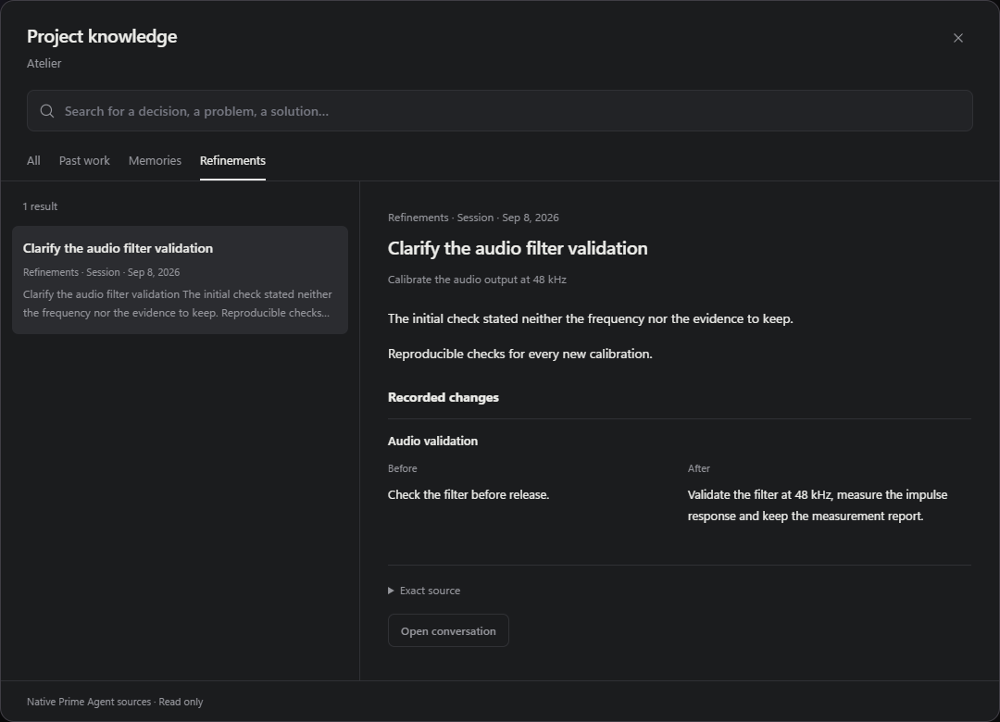

[Knowledge guide →](docs/en/knowledge.md)

## Also from your phone

On the PC, open **Preferences → Remote access** and enable **Local network**. The change applies immediately, without restarting or interrupting agents. At first activation, save the eight-digit PIN shown only once; later activations keep it. Connect the phone to the same network, then use **Copy link** or the **QR code**: the QR contains only the address, and the PIN is requested when connecting. The sign-in cookie lasts eight hours.

<p align="center">
  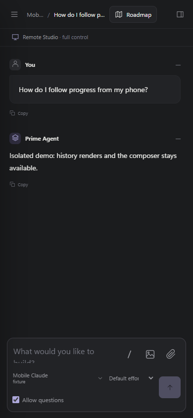
</p>

<p align="center">
  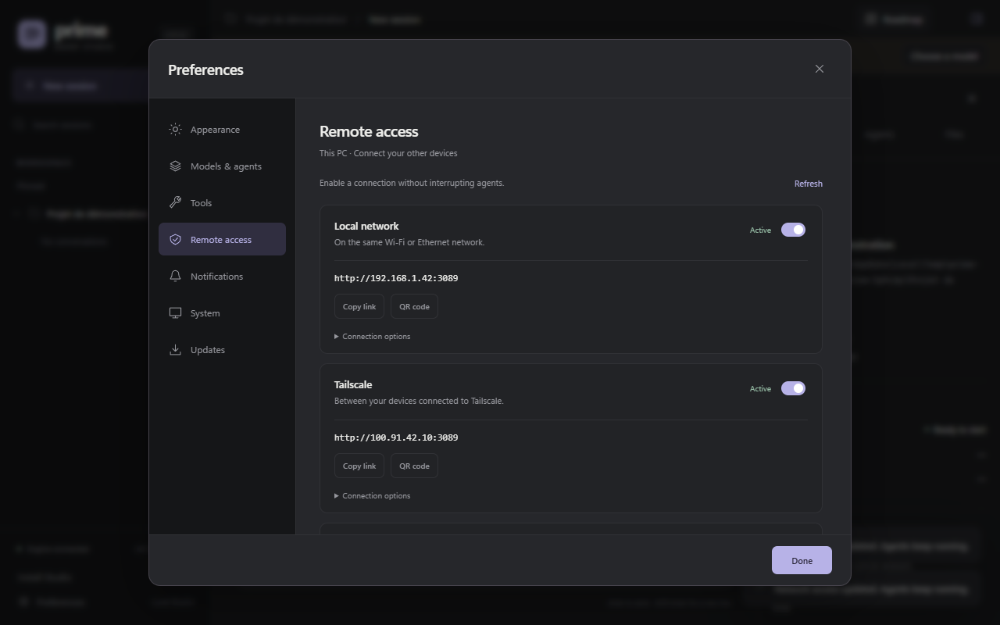
</p>

You can create or resume a session, send messages and follow work live; the PC runs the agents and must stay on. The default mobile port is `3089`, shared by LAN and Tailscale; port `3088` stays reserved for the PC. LAN access uses HTTP on your local network: Studio is not meant to be exposed on the Internet. Remote access is **read-only** by default and switches to full control with `readOnly: false`; devices must then sign in again.

On the PC, **Preferences → Remote access → Change code** changes the eight-digit PIN shared by Wi-Fi, Tailscale and the PWA (a leading zero is accepted). The code is stored neither in plain text on the PC nor in browser storage; devices must sign in again with the new code, without restarting Studio. To reach Studio **away from Wi-Fi, over 4G/5G**, connect the PC and the phone to the same Tailscale network, then enable **Tailscale** in the same section. [Configure LAN, Tailscale, the code and read-only mode →](docs/en/lan.md)

## Install Studio as an app

Studio is an **installable PWA**. With Tailscale connected on the PC and the phone, open **Preferences → Remote access** on the PC and enable **Tailscale HTTPS**. Activation preserves your access code and shows a `https://pc-name.network-name.ts.net` address, without restarting or interrupting agents. Open that link in the phone's browser and use **Install Studio**. On iPhone, use **Safari → Share → Add to Home Screen**.

The PWA keeps the site's commands and attachments; drafts stay stored per device and per address. If the connection drops, a **Retry** screen helps you get back. The PC is still required to run agents; closing the app lets them keep working. The Tailscale Serve gateway forwards locally to port **3090** on `127.0.0.1`, and no public opening is configured. [Android, iPhone and PC installation, HTTPS and offline behavior →](docs/en/pwa.md)

**Mobile notifications (closed PWA):** **Preferences → Notifications → Mobile notifications** enables **Questions** and **Turn completed** alerts on that device, disabled by default. The server sends a generic encrypted notification, without project or question content; tapping it reopens the relevant session. Requirements: PWA installed from the Tailscale HTTPS address, notifications allowed, PC on with an active server, Tailscale connected on both sides. On iPhone/iPad: iOS 16.4 or later, app added via **Safari → Share → Add to Home Screen**, opened from the icon, then notification permission granted.

<p align="center">
  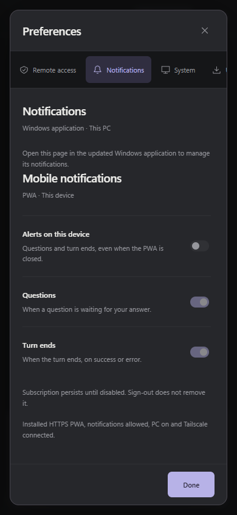
</p>

## Windows application and updates

The application, built with Tauri 2, opens Studio in a dedicated Windows window and starts the server quietly. **Closing the window** hides it while keeping the tray icon: agents, server and mobile access continue. **Start with Windows**, disabled by default, launches Studio in the background when you sign in.

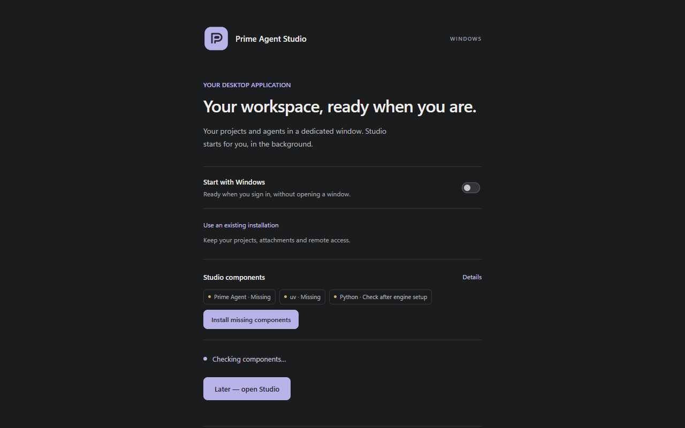

In the current source tree, guided setup pairs Studio with **Prime Agent 0.9.5**, **npm 10.9.4** and **uv 0.8.22**, with Python 3.11. Archives are checked against their inventories and hashes before validation; no automatically detected external component runs without your explicit choice. Components live in the data folder, under `engine/`, with Python kernels in `.local`.

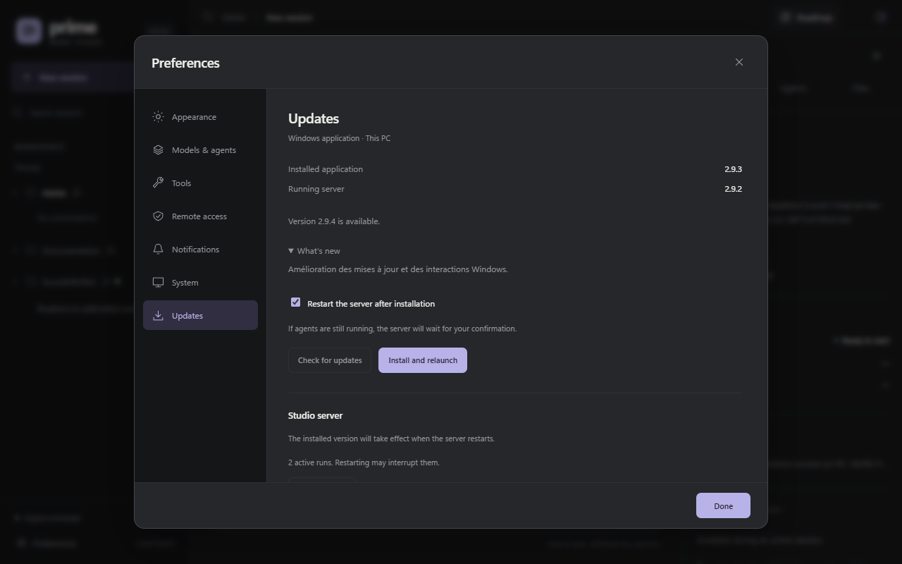

- **Data**: the `%LOCALAPPDATA%\com.primeagent.studio` folder (projects, attachments, hashed PIN, network, logs, Python kernels, server copies). An update prepares a new server copy; **Preferences → Updates** distinguishes the installed version from the active server version.
- **From a phone** (write access): steering an update follows the same conditions — an active Windows application and no running agents; installation and restart execute on the Windows side. Everyday control (messages, sessions, projects) remains fully available on mobile.

In Studio, open **Preferences → Updates → Check for updates**: this check is manual, with no background polling. If a newer stable version is published on GitHub, its highlights and the **Install & relaunch** button appear. The download shows its progress, then Tauri verifies the signature before installing; no installation starts without that click. A network error, a missing catalog or an invalid signature are never reported as "up to date". The **Restart server after installation** option applies the new version when no agent is working; otherwise the server stays active and **Restart server** shows a confirmation, since restarting may interrupt runs. [Windows application guide →](docs/en/desktop.md)

## Documentation

| Guide                                                 | Contents                                                                 |
| ----------------------------------------------------- | ------------------------------------------------------------------------ |
| [Configuration and data](docs/en/configuration.md)    | Models, defaults, storage and environment variables.                     |
| [Projects and conversations](docs/en/navigation.md)   | Expandable projects, search, archives, menus and reordering.             |
| [Project knowledge](docs/en/knowledge.md)             | Past work, native memories, refinements and agent history tools.         |
| [Project roadmap](docs/en/roadmap.md)                 | Shared plans, checklists, backlog, native tools and conversation links.  |
| [Providers](docs/en/providers.md)                     | Account connections, API keys, sign-out and PC-only access.              |
| [Mobile access](docs/en/lan.md)                       | Activation, network address, authentication and permissions.             |
| [Installable application](docs/en/pwa.md)             | PWA installation, private HTTPS and reconnection.                        |
| [Windows application](docs/en/desktop.md)             | Windows window, components, data and updates.                            |
| [Development](docs/en/development.md)                 | Architecture, silent Windows processes, tests and reproducible captures. |
| [Agents and files](docs/en/inspector.md)              | Subagents, usage, Git changes, previews and document opening.            |
| [Commands and skills](docs/en/commands.md)            | Native commands, shortcuts, skills and project prompts.                  |
| [MCP connections](docs/en/mcp.md)                     | Servers, OAuth, allowed tools and connection diagnostics.                |
| [Languages and translations](docs/en/translations.md) | Interface translations and two-language documentation upkeep.            |

To verify the project:

```powershell
npm run check
npm test
npm run test:ui
npm run test:mobile
npm run test:attachments
npm run test:pwa
npm run test:inspector
npm run test:providers
```

Automated tests use temporary data and a simulated engine.

## License and attribution

Prime Agent Studio is developed by **[zerr0o](https://github.com/zerr0o)** and distributed under the [MIT license](LICENSE). Copyright © 2026 zerr0o.

You may use, modify and redistribute this project, including for commercial purposes, while keeping the **zerr0o** copyright notice and the license text in copies or substantial portions of the software. The [LICENSE](LICENSE) file contains the [standard MIT license text](https://opensource.org/license/mit).

Prime Agent and third-party dependencies keep their respective licenses.

---

<p align="center">
  <strong>Prime Agent Studio</strong><br>
  A local interface around Prime Agent, with your existing sessions and configuration.
</p>
